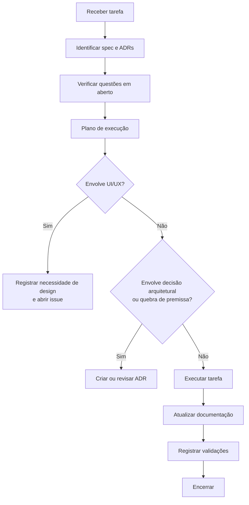

# AGENTS.md

> Guia operacional para agentes de desenvolvimento (humanos ou IA) que atuam neste repositório.

## Estado do projeto

| Item | Estado |
| --- | --- |
| Implementação | **Não iniciada** |
| Especificação | Em construção |
| MVP | Planejado |

Este repositório contém **apenas documentação** até nova instrução explícita. Não crie código de produção, migrations reais, configurações de deploy, scripts destrutivos ou integrações ao vivo sem autorização.

## Missão do agente

Sua função é manter, evoluir e, quando autorizado, implementar a plataforma OCAB respeitando:

1. Os 14 ADRs já registrados.
2. As 14 specs já publicadas.
3. O roadmap em [`docs/planning/roadmap.md`](docs/planning/roadmap.md).
4. O escopo definido em [`docs/project/scope.md`](docs/project/scope.md).
5. As restrições obrigatórias listadas em [`docs/project/scope.md`](docs/project/scope.md#restrições-obrigatórias).

## Ordem de leitura obrigatória

Antes de qualquer tarefa:

```text
README.md
docs/README.md
docs/project/vision.md
docs/project/scope.md
docs/architecture/system-design.md
docs/discovery/README.md
docs/discovery/phase-0-report.md (quando existir)
docs/planning/roadmap.md
docs/planning/backlog.md
spec da tarefa atribuída
ADRs relacionados
docs/open-questions.md
```

## Regras inegociáveis

1. **Não amplie escopo.** Se a tarefa é X, entregue X. Proponha ampliações em uma ADR ou em `docs/open-questions.md`.
2. **Não reverta ADRs silenciosamente.** Mudanças de premissa bloqueada exigem nova ADR que referencie a anterior.
3. **Não introduza dependências externas sem justificativa.** Liste alternativas, riscos e custo de manutenção.
4. **Não insira segredos reais.** Use placeholders como `__SET_ME__` e descreva a gestão em [`docs/security/secrets-management.md`](docs/security/secrets-management.md).
5. **Não afirme que algo funciona sem evidência.** Use os marcadores de status.
6. **Não monte Docker socket em nenhum container.** Mantenha a restrição da ADR-0006.
7. **Não automatize push, merge ou deploy.** Mantenha a restrição da ADR-0008.
8. **Não utilize caminhos físicos arbitrários.** Repositórios são identificados por slug (ADR-0014).
9. **Não execute comandos destrutivos** (`rm -rf /`, `git reset --hard`, etc.) sem aprovação explícita.
10. **Documente qualquer decisão nova** como ADR ou como entrada em `docs/open-questions.md`.

## Marcadores de status

Use sempre um destes rótulos ao descrever um item:

```text
Status: Proposed
Status: Accepted
Status: Planned
Status: In Discovery
Status: Not Implemented
Status: Implemented (apenas após validação real)
```

## Convenções

* Identificadores de requisito: `<AREA>-<TIPO>-<NNN>` (ex.: `RUN-FR-001`, `MCP-NFR-002`, `SEC-NFR-001`).
* Identificadores de ADR: `NNNN` com 4 dígitos e zero-padded.
* Identificadores de spec: `NNN` com 3 dígitos e zero-padded.
* Diagramas em Mermaid. **Não use sintaxe experimental.**
* Links relativos entre documentos.
* Termos técnicos em inglês quando são nomes próprios (MCP, OpenCode, Codex, etc.). Texto corrente em português.

## Fluxo recomendado para uma tarefa



> Este fluxo **não** depende de agentes internos específicos (como "designer" ou "oráculo"). Toda revisão arquitetural deve produzir uma ADR ou atualizar uma existente. Toda necessidade de design deve ser registrada como issue ou entrada em `docs/open-questions.md`, sem despacho para agentes não definidos nesta especificação.

## Verificações antes de encerrar

* [ ] Todos os arquivos novos estão linkados em `docs/README.md`.
* [ ] Todos os requisitos novos possuem ID estável.
* [ ] Critérios de aceite são verificáveis (Dado/quando/então ou equivalente).
* [ ] Nenhuma referência a `host.docker.internal`, WSL, `localhost` no host ou caminhos absolutos arbitrários foi introduzida.
* [ ] Nenhuma senha, token ou chave real foi inserida.
* [ ] Diagramas Mermaid renderizam.
* [ ] A spec afetada foi atualizada.
* [ ] O backlog foi atualizado, se aplicável.
* [ ] O `docs/open-questions.md` foi atualizado se novas dúvidas surgiram.

## Quando escalar

| Sinal | Ação |
| --- | --- |
| Mudança de premissa bloqueada | Abrir ADR substituta |
| Necessidade de nova dependência externa | ADR + entradas em risk register e open questions |
| Contradição entre documentos | Sinalizar e propor reconciliação |
| Exposição de segredo detectada | Acionar [`docs/security/incident-response.md`](docs/security/incident-response.md) |
| Trabalho paralelo a outro agente | Coordenar para evitar escrita concorrente no mesmo arquivo |
