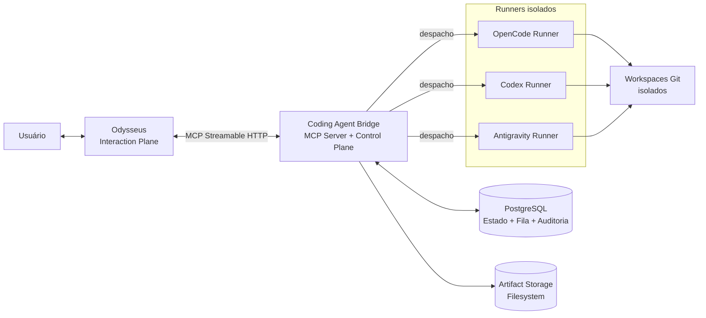
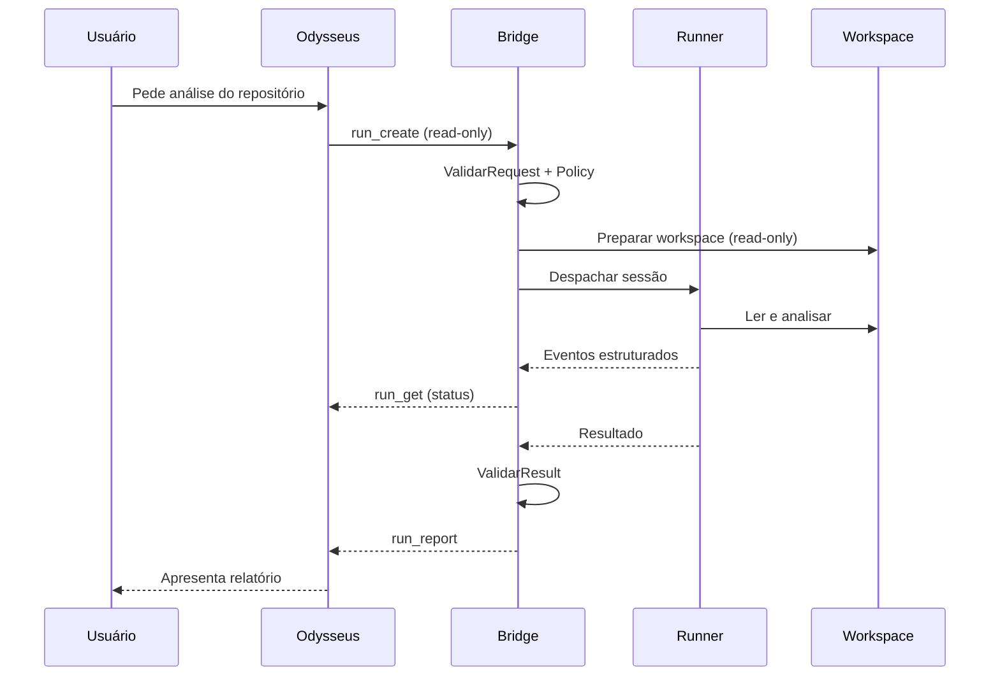

# Odysseus Coding Agent Bridge (OCAB)

> **Status:** Specification
> **Implementation:** Not started
> **MVP:** Planned
>
> Documentação em construção. Este repositório ainda **não contém código de produção**. Toda a informação aqui descreve o sistema proposto, decisões de arquitetura e planos de entrega. Componentes referenciados não estão implementados até que a fase correspondente do roadmap seja concluída.

## Problema

Equipes que adotam agentes de desenvolvimento (OpenCode, Codex, futuros agentes compatíveis) enfrentam desafios recorrentes:

* Orquestração de múltiplos agentes sob uma interface comum.
* Isolamento de repositórios durante alterações automatizadas.
* Aplicação de políticas de segurança fora do prompt.
* Rastreabilidade de execuções, decisões e artefatos.
* Coleta estruturada de diffs, logs e validações.
* Garantia de que merges, pushes e deploys nunca sejam automáticos.

Esses problemas pioram quando o agente de desenvolvimento passa a controlar diretamente o ambiente do desenvolvedor ou o repositório de produção.

## Proposta

O **Odysseus Coding Agent Bridge (OCAB)** é uma plataforma local que:

1. Expõe uma interface MCP padronizada para o **Odysseus** (plano de interação e memória).
2. Recebe solicitações, valida entradas e seleciona o agente apropriado.
3. Cria workspaces Git isolados para qualquer alteração.
4. Despacha a execução para um **runner** dedicado por agente.
5. Aplica políticas determinísticas antes, durante e depois da execução.
6. Coleta diffs, logs, validações e artefatos.
7. Persiste estado, eventos e auditoria em PostgreSQL.
8. Devolve um relatório estruturado ao Odysseus.

A aprovação humana continua obrigatória para merges, pushes, pull requests e deploys.

## Arquitetura resumida



## Papéis

### Odysseus (plano de interação)
* Interface conversacional.
* Memória, documentos, pesquisa e planejamento.
* Composição de contexto.
* Chamada de ferramentas MCP.
* Apresentação de resultados.
* **Não** edita repositórios, **não** executa agentes, **não** conhece comandos internos.

### Coding Agent Bridge (plano de controle)
* Servidor MCP Streamable HTTP.
* Autenticação, validação, registro de repositórios e agentes.
* Máquina de estados da execução (`Run`).
* Fila de execução (PostgreSQL no MVP).
* Políticas determinísticas (fora do modelo).
* Criação e limpeza de workspaces isolados.
* Despacho, cancelamento e timeout.
* Coleta de diff, logs e artefatos.
* Relatório final padronizado.
* Auditoria.

### Runners (plano de execução)
* OpenCode Runner (MVP).
* Codex Runner (pós-MVP).
* Antigravity Runner (pós-MVP, sujeito a discovery).
* Cada runner é um container separado, não-root, sem Docker socket, com limites de recursos.

## Fluxo de uma execução (read-only)



## O que está dentro do MVP

* Coding Agent Bridge como servidor MCP Streamable HTTP.
* PostgreSQL para estado, eventos, fila e auditoria.
* Repositórios identificados por slug (allowlist).
* Workspaces isolados com branch de execução.
* OpenCode Runner como executor.
* Execuções read-only e workspace-write controladas.
* Máquina de estados completa.
* Cancelamento, timeout e retry idempotente.
* Pipeline de validação declarativo.
* Artefatos no filesystem referenciados pelo banco.
* Logs estruturados, métricas e traces.
* Relatório final padronizado.
* Aprovação humana obrigatória antes de aplicar alterações fora do workspace.

## O que **não** está dentro do MVP

* Codex Runner (entra após o MVP).
* Antigravity Runner (entra após discovery da interface).
* Push, merge, deploy ou criação automática de pull request.
* Execução de runner com Docker socket.
* Autenticação avançada de múltiplos usuários.
* Dashboards de observabilidade prontos (apenas baseline de coleta).
* Multi-tenant.

## Status atual

| Item | Estado |
| --- | --- |
| Especificação | Em construção |
| Decisões arquiteturais | 14 ADRs propostos |
| MVP vertical read-only | Planejado (Fase 3) |
| Execução de escrita | Planejado (Fase 5) |
| Codex Runner | Pós-MVP (Fase 8) |
| Antigravity Runner | Pós-MVP (Fase 9) |

## Onde encontrar informação

| Necessidade | Documento |
| --- | --- |
| Visão e escopo | [`docs/project/vision.md`](docs/project/vision.md), [`docs/project/scope.md`](docs/project/scope.md) |
| Design do sistema | [`docs/architecture/system-design.md`](docs/architecture/system-design.md) |
| Decisões arquiteturais | [`docs/adr/`](docs/adr/) |
| Especificações por área | [`docs/specs/`](docs/specs/) |
| Contratos MCP | [`docs/contracts/mcp-tools.md`](docs/contracts/mcp-tools.md) |
| Modelo de dados | [`docs/data/conceptual-model.md`](docs/data/conceptual-model.md) |
| Segurança | [`docs/security/threat-model.md`](docs/security/threat-model.md) |
| Operação | [`docs/operations/deployment.md`](docs/operations/deployment.md) |
| Roadmap | [`docs/planning/roadmap.md`](docs/planning/roadmap.md) |
| Backlog | [`docs/planning/backlog.md`](docs/planning/backlog.md) |
| Questões em aberto | [`docs/open-questions.md`](docs/open-questions.md) |

## Como futuros agentes devem iniciar o trabalho

1. Ler [`AGENTS.md`](AGENTS.md).
2. Ler [`docs/README.md`](docs/README.md).
3. Localizar a spec correspondente à tarefa atribuída.
4. Consultar os ADRs relacionados.
5. Verificar questões em aberto e risk register.
6. Não ampliar escopo silenciosamente.
7. Documentar qualquer nova decisão como ADR.
8. Atualizar documentação afetada.
9. Registrar pendências e riscos.

A base documental é projetada para que um agente consiga trabalhar de forma segura, incremental e coerente com a arquitetura do projeto recebendo apenas:

```text
AGENTS.md
spec da tarefa
ADRs relacionados
```
