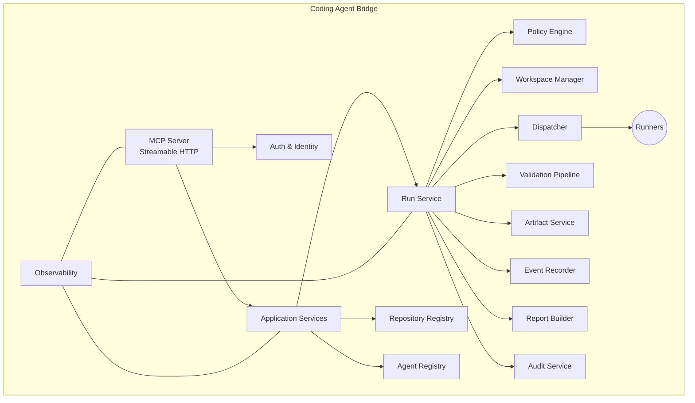
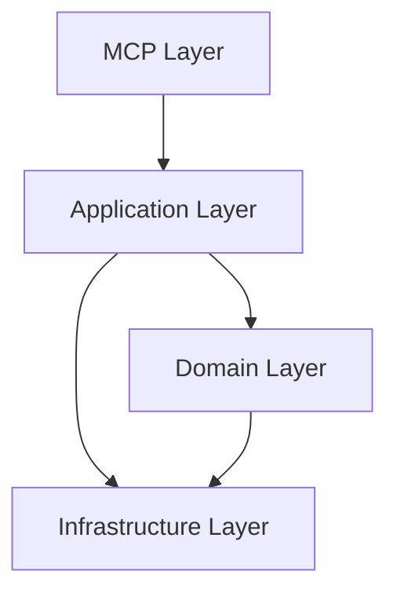

# Component Architecture (C4 Nível 3)

> **Status:** Accepted

Detalha os componentes internos do Coding Agent Bridge.

## Visão

O Coding Agent Bridge é uma aplicação .NET 8 com ASP.NET Core organizada em camadas bem definidas, com responsabilidade única por componente. A separação facilita testes e revisão.

## Diagrama

## Componentes

### MCP Server

* Endpoint Streamable HTTP.
* Roteia chamadas para os serviços de aplicação.
* Aplica autenticação e limites.
* Registra métricas, logs e traces.

### Auth & Identity

* Verifica credenciais do cliente MCP.
* Aplica autorização por escopo (repositórios e agentes).
* Não implementa multi-tenant no MVP.

### Application Services

* Orquestram o uso dos serviços de domínio.
* Implementam casos de uso (criar run, listar repositórios, gerar relatório).
* Convertem contratos MCP em comandos internos e vice-versa.

### Repository Registry

* Mantém a allowlist de repositórios.
* Valida slug.
* Fornece configuração de validações e políticas por repositório.

### Agent Registry

* Mantém o catálogo de agentes.
* Define capacidades por agente.
* Aplica permissões cruzadas com repositórios.

### Run Service

* Coordena o ciclo de vida da execução.
* Implementa a máquina de estados (ver spec 003).
* Garante idempotência, retry e reconciliação.

### Policy Engine

* Aplica regras determinísticas antes, durante e depois da execução.
* Audita cada decisão.
* Não depende de prompt ou modelo.

### Workspace Manager

* Cria e limpa workspaces isolados.
* Garante permissões de leitura no repositório original.
* Aplica branch de execução.

### Dispatcher

* Encaminha a execução para o runner apropriado.
* Mantém contrato uniforme entre bridge e runner.
* Lida com cancelamento e timeout.

### Validation Pipeline

* Executa comandos declarativos por repositório.
* Coleta resultados estruturados.
* Distingue falha de validação de falha de infraestrutura.

### Artifact Service

* Persiste artefatos no filesystem.
* Calcula checksum.
* Mantém referência no banco.

### Event Recorder

* Persiste eventos da execução de forma append-only.
* Alimenta auditoria e reconciliação.

### Report Builder

* Consolida diffs, validações, findings e artefatos.
* Gera relatório no contrato de `run_report`.

### Audit Service

* Persiste decisões de política.
* Oferece consulta por `runId` ou intervalo de tempo.

### Observability

* Middleware e bibliotecas de instrumentação.
* Emite logs, métricas e traces correlacionados por `runId`.

## Camadas e dependências

* **Interface Layer:** MCP server, autenticação, contratos.
* **Application Layer:** casos de uso, orquestração.
* **Domain Layer:** entidades, regras de negócio, máquina de estados.
* **Infrastructure Layer:** persistência, filesystem, subprocessos, cliente HTTP.

## Princípios aplicados

* Inversão de dependência: adapters de runner e persistência implementam interfaces definidas na camada de domínio.
* Testabilidade: cada componente é testável isoladamente via interfaces.
* Princípio da menor privilégio: cada componente só consome o que precisa.

## Referências relacionadas

* [`system-design.md`](system-design.md)
* [`runtime-flows.md`](runtime-flows.md)
* [`../specs/003-run-lifecycle/spec.md`](../specs/003-run-lifecycle/spec.md)
* [`../specs/004-mcp-contract/spec.md`](../specs/004-mcp-contract/spec.md)
* [`../specs/006-policy-engine/spec.md`](../specs/006-policy-engine/spec.md)
