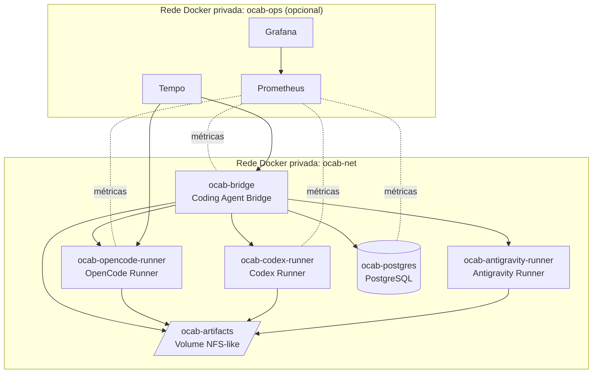

# Container Architecture (C4 Nível 2)

> **Status:** Accepted

## Visão

Detalha os containers do OCAB, sua topologia Docker e suas fronteiras de isolamento.

## Diagrama



## Containers e responsabilidades

| Container | Responsabilidade | Usuário | Recursos limite | Volume |
| --- | --- | --- | --- | --- |
| `ocab-bridge` | Servidor MCP, máquina de estados, fila, política | não root | CPU/memória configuráveis | `artifacts`, `workspaces` |
| `ocab-opencode-runner` | Execução do OpenCode | não root | CPU/memória/PIDs limitados | `workspaces` (RW isolado), `artifacts` (R) |
| `ocab-codex-runner` | Execução do Codex | não root | idem | idem |
| `ocab-antigravity-runner` | Execução do Antigravity | não root | idem | idem |
| `ocab-postgres` | Persistência | postgres | disco provisionado | `pgdata` |
| `ocab-artifacts` (volume) | Armazenamento de artefatos | rootfs do host | disco provisionado | montado por bridge e runners |

## Restrições de isolamento

* Nenhum container monta `/var/run/docker.sock` (ADR-0006).
* Apenas o bridge tem acesso de escrita ao volume de artefatos; runners têm leitura.
* Workspaces são volumes nomeados por execução, criados e destruídos pelo bridge.
* Runners não acessam o bridge diretamente; o bridge orquestra a comunicação via adapter.
* O bridge não acessa repositórios Git em modo write.

## Redes

| Rede | Membros | Publicação externa |
| --- | --- | --- |
| `ocab-net` | bridge, runners, postgres, artifact volume mounts | Nenhuma porta publicada por padrão. Exceções documentadas via ADR. |
| `ocab-ops` | bridge (scraper), runners (exporter), prometheus, grafana, tempo | Definida em ADR específica. |

## Volumes

| Volume | Conteúdo | Propriedade |
| --- | --- | --- |
| `ocab-pgdata` | Dados do PostgreSQL | root do postgres |
| `ocab-artifacts` | Logs, diffs, relatórios, eventos | rootfs compartilhado entre bridge e runners |
| `ocab-workspace-<runId>` | Workspace de uma execução específica | ephemeral por execução |

## Topologia de DNS

Todos os serviços se referenciam por nome Docker na rede privada. Exemplos:

```text
http://ocab-bridge:9010/mcp
http://ocab-opencode-runner:4096
http://ocab-codex-runner:5000
http://ocab-antigravity-runner:6000
postgres://ocab-postgres:5432
```

## Decisões relacionadas

* ADR-0006 (sem Docker socket).
* ADR-0009 (OpenCode como primeiro runner).
* ADR-0010 (Codex como segundo runner).
* ADR-0011 (Antigravity após MVP).
* ADR-0012 (artefatos no filesystem).
* ADR-0013 (rede Docker privada).

## Próximos passos documentais

* Definir limites padrão de CPU/memória/PIDs por runner.
* Definir estratégia de segregação de volumes por execução.
* Validar interface exata entre bridge e runners.
