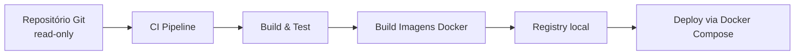

# Deployment Architecture

> **Status:** Accepted

## Princípios

* Toda a infraestrutura executa em Linux com Docker Engine e Docker Compose.
* Nenhuma publicação de porta no host além das estritamente necessárias.
* Repositórios de origem acessados via Git remoto em modo read-only.
* Persistência em volumes nomeados.

## Ambientes

| Ambiente | Propósito | Composição |
| --- | --- | --- |
| `local-dev` | Desenvolvimento local | Compose com bridge, postgres, opencode-runner, artifact volume |
| `ci` | Testes automatizados | Compose descartável com fixtures |
| `staging` | Validação pré-produção | Compose próximo ao de produção |
| `prod` | Operação | Compose end-to-end |

## Pipeline de implantação

## Configuração por ambiente

* Variáveis de ambiente em `.env` (não versionado).
* Templates versionados em `deploy/`.
* Placeholders `__SET_ME__` para segredos.
* Carregamento explícito via `docker compose --env-file`.

## Persistência

| Volume | Ambiente local | Produção |
| --- | --- | --- |
| `ocab-pgdata` | Volume nomeado | Volume em disco provisionado |
| `ocab-artifacts` | Volume nomeado | Volume em disco provisionado, com política de retenção |
| `ocab-runner-cache` | Opcional | Cache efêmero |

## Rede

* `ocab-net` para tráfego interno.
* `ocab-ops` para coleta de métricas (opcional).
* Nenhuma porta publicada para o host, exceto:
  * `ocab-bridge` MCP: somente quando explicitamente autorizado (porta documentada).
  * `ocab-postgres`: nunca exposto ao host.
  * `ocab-runners`: nunca expostos ao host.

## Atualização

* Imagens construídas localmente ou via registry interno.
* `docker compose pull` e `docker compose up -d` após validação.
* Nenhum auto-update aplicado.

## Rollback

* Imagens anteriores mantidas localmente.
* Reverter via `docker compose up -d` com tag anterior.
* Restauração de banco via `pg_restore` em janela de manutenção.

## Decisões relacionadas

* ADR-0006 (sem Docker socket).
* ADR-0013 (rede Docker privada).
* ADR-0014 (slug de repositório).

## Referências relacionadas

* [`../operations/deployment.md`](../operations/deployment.md)
* [`../operations/configuration.md`](../operations/configuration.md)
* [`../operations/backup-and-restore.md`](../operations/backup-and-restore.md)
