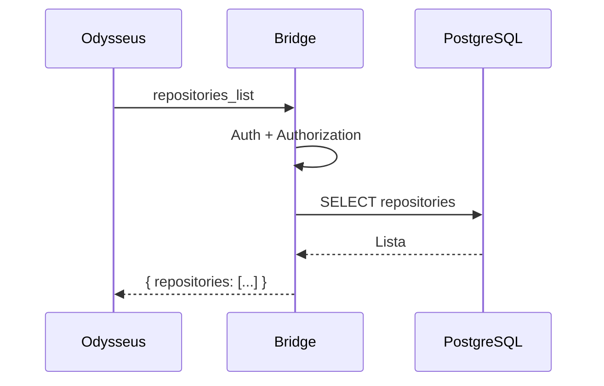
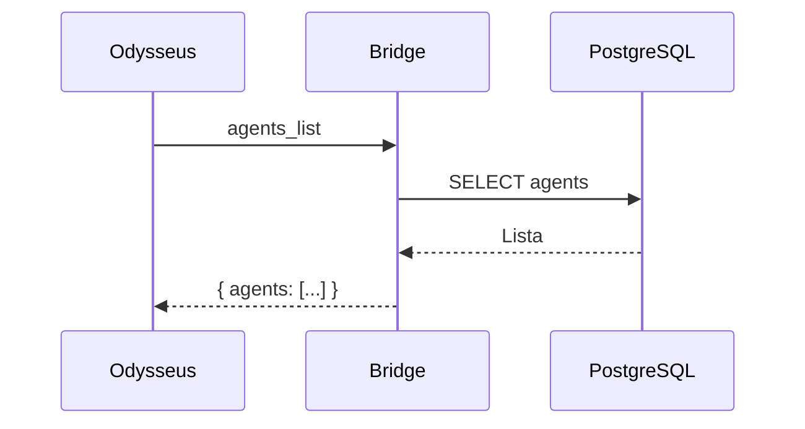
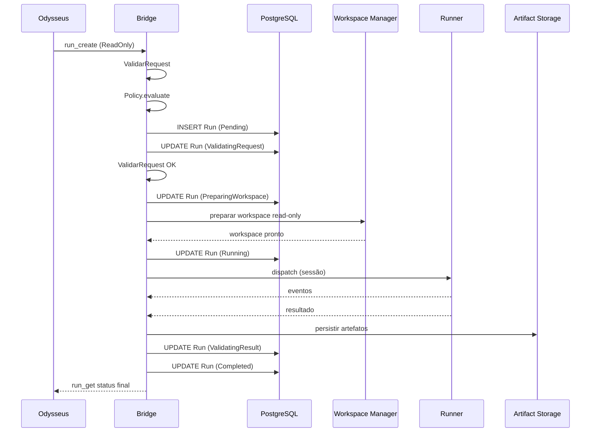
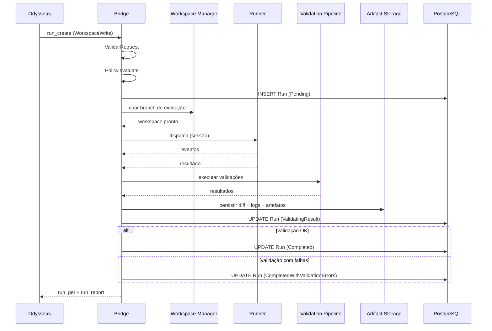
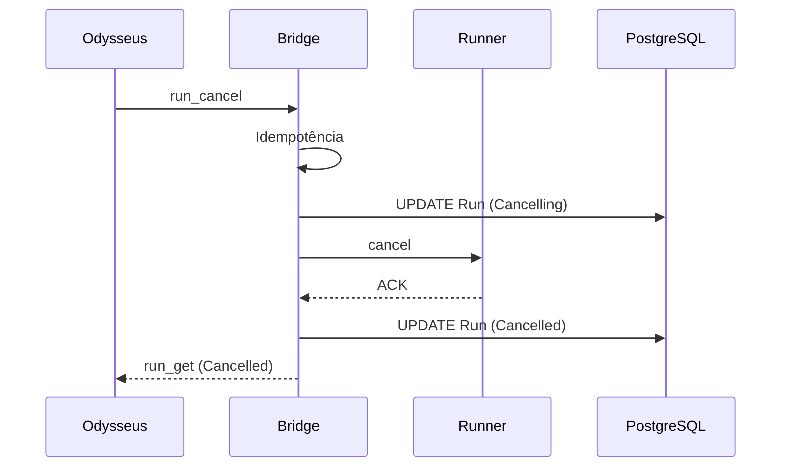
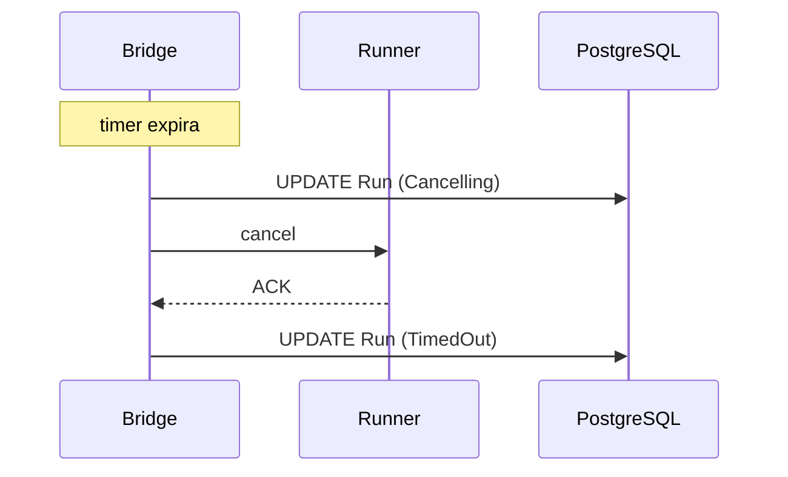
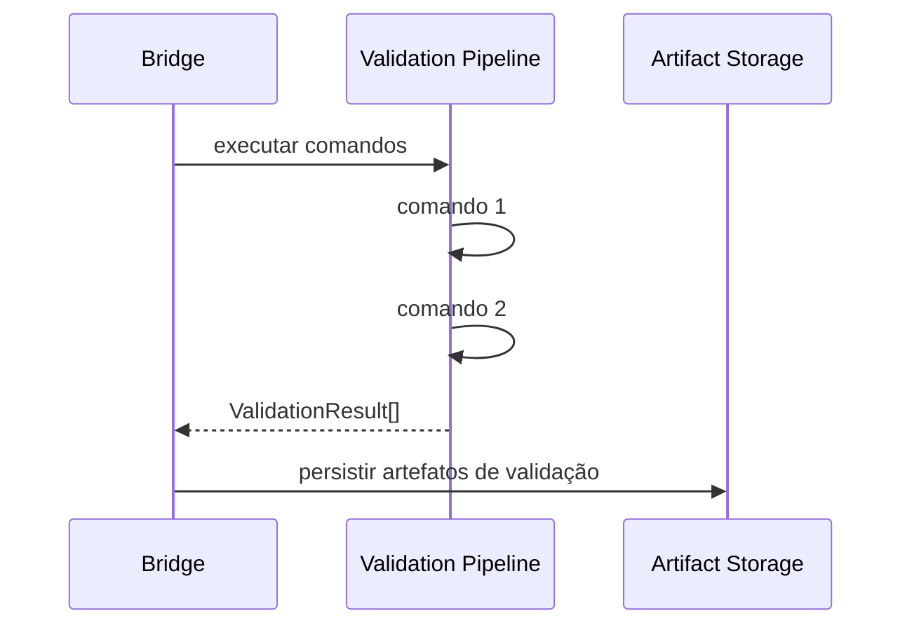
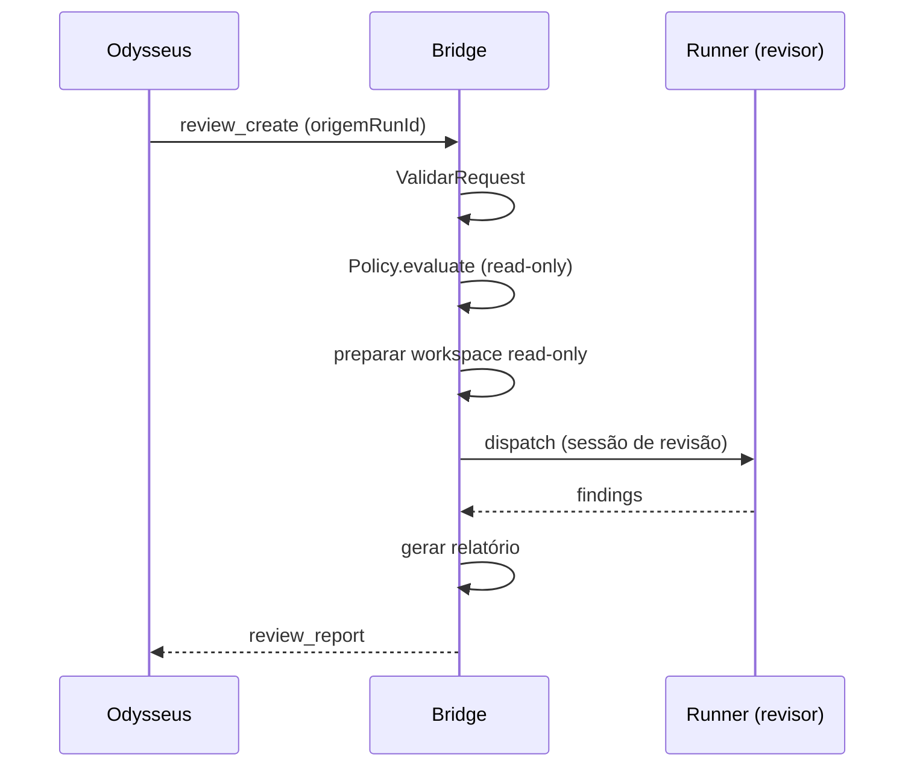
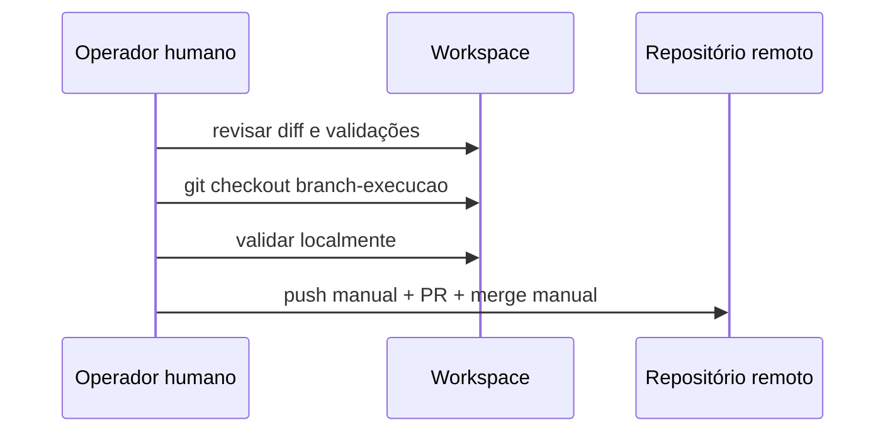

# Runtime Flows

> **Status:** Accepted

## Visão

Documenta os fluxos de execução mais importantes do Coding Agent Bridge. Cada fluxo é descrito em sequência e referenciado pelas specs correspondentes.

## Fluxos

### 1. Listagem de repositórios

### 2. Listagem de agentes

### 3. Criação de run read-only

### 4. Criação de run workspace-write

### 5. Cancelamento

### 6. Timeout

### 7. Validação

### 8. Revisão independente

### 9. Aplicação de alteração aprovada (manual)

## Estados e transições

Ver [`../specs/003-run-lifecycle/spec.md`](../specs/003-run-lifecycle/spec.md) para a máquina de estados completa.

## Erros e exceções

* Erros de validação de entrada são retornados ao cliente sem alterar estado da execução.
* Erros de infraestrutura disparam estado `Failed` e emitem evento de incidente.
* Erros de política disparam estado `Rejected` ou `Cancelled` conforme o momento.
* Cancelamento incompleto é tratado pelo [`../specs/007-workspace-isolation/spec.md`](../specs/007-workspace-isolation/spec.md) e reconciliação após restart.

## Referências relacionadas

* [`system-design.md`](system-design.md)
* [`../specs/003-run-lifecycle/spec.md`](../specs/003-run-lifecycle/spec.md)
* [`../specs/005-opencode-runner/spec.md`](../specs/005-opencode-runner/spec.md)
* [`../specs/006-policy-engine/spec.md`](../specs/006-policy-engine/spec.md)
* [`../contracts/runner-adapter.md`](../contracts/runner-adapter.md)
