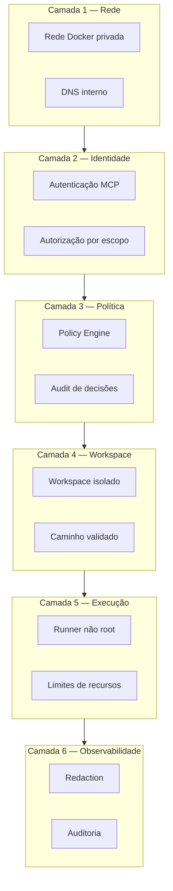
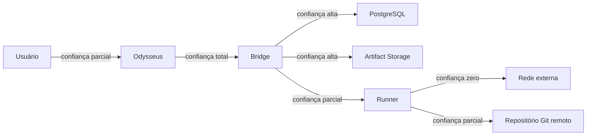

# Security Architecture

> **Status:** Accepted

## Princípios

1. Política fora do modelo (ADR-0007).
2. Repositório original sempre read-only (ADR-0005).
3. Sem Docker socket (ADR-0006).
4. Aprovação humana obrigatória (ADR-0008).
5. Segredos nunca em prompts, logs ou artefatos.
6. Auditabilidade completa.

## Camadas de defesa

## Fronteiras de confiança

Para detalhes, ver [`../security/trust-boundaries.md`](../security/trust-boundaries.md).

## Threat model (resumo)

Ver [`../security/threat-model.md`](../security/threat-model.md) para a versão completa.

| Categoria | Exemplos |
| --- | --- |
| Spoofing | Falsificação de identidade no MCP, falsificação de evento. |
| Tampering | Modificação de artefatos, manipulação de relatório. |
| Repudiation | Execuções sem auditoria, decisões sem trilha. |
| Information disclosure | Vazamento de segredos em logs, exfiltração via rede. |
| Denial of service | Fork bomb, preenchimento de disco, consumo de CPU. |
| Elevation of privilege | Escape de workspace, execução como root. |

## Política de comandos

A política é aplicada pelo `Policy Engine` antes da execução. A lista textual é complementada por:

* Usuário não root.
* Diretório de trabalho confinado ao workspace.
* Ausência de credenciais de escrita.
* Limites de CPU/memória/PIDs.
* Redaction em logs.

A lista completa está em [`../security/command-policy.md`](../security/command-policy.md).

## Endurecimento de containers

Ver [`../security/container-hardening.md`](../security/container-hardening.md).

* Imagens mínimas.
* Usuário não root.
* `read_only` rootfs onde aplicável.
* `cap_drop: ALL` e adição explícita.
* `security_opt: no-new-privileges`.
* Sem `pid` ou `ipc` compartilhado.
* Sem montagem do Docker socket.

## Gestão de segredos

* Segredos nunca são persistidos em texto puro.
* Carregados em runtime a partir de arquivo montado em volume específico.
* Placeholders `__SET_ME__` em arquivos versionados.
* Prompts nunca incorporam credenciais.
* Logs e relatórios passam por redaction antes da gravação.

Detalhes em [`../security/secrets-management.md`](../security/secrets-management.md).

## Resposta a incidentes

Ver [`../security/incident-response.md`](../security/incident-response.md).

* Identificação.
* Contenção.
* Erradicação.
* Recuperação.
* Lições aprendidas.

## Decisões relacionadas

* ADR-0005 (isolamento de workspaces).
* ADR-0006 (sem Docker socket).
* ADR-0007 (política fora do modelo).
* ADR-0008 (aprovação humana).
* ADR-0014 (slug de repositório).

## Referências relacionadas

* [`../security/threat-model.md`](../security/threat-model.md)
* [`../security/trust-boundaries.md`](../security/trust-boundaries.md)
* [`../security/command-policy.md`](../security/command-policy.md)
* [`../security/container-hardening.md`](../security/container-hardening.md)
* [`../specs/006-policy-engine/spec.md`](../specs/006-policy-engine/spec.md)
* [`../specs/011-security-hardening/spec.md`](../specs/011-security-hardening/spec.md)
