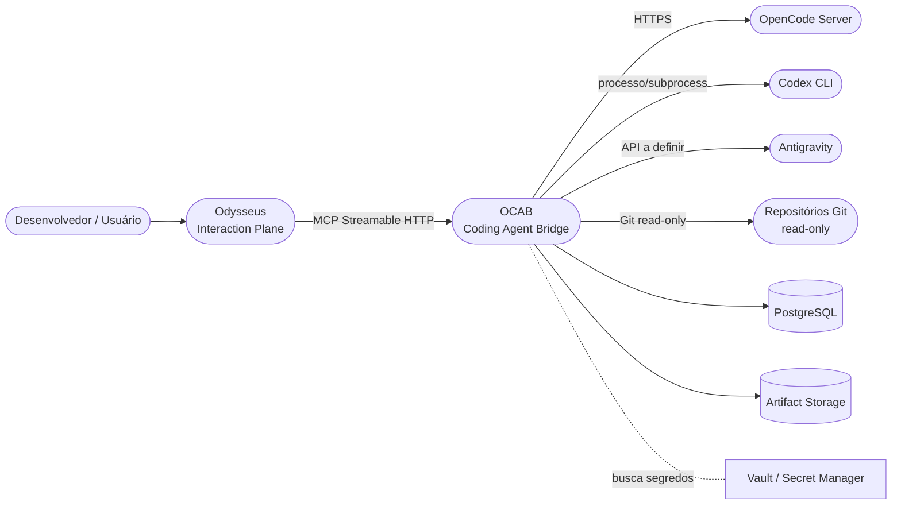

# System Context (C4 Nível 1)

> **Status:** Accepted

## Visão

Visão de mais alto nível do sistema: como o OCAB se posiciona em relação a usuários, ao Odysseus e aos agentes externos.

## Diagrama

## Atores e sistemas externos

| Ator | Tipo | Descrição |
| --- | --- | --- |
| Desenvolvedor | Pessoa | Usuário final que interage via Odysseus. |
| Odysseus | Sistema externo | Plano de interação conversacional, memória e orquestração. |
| OpenCode Server | Sistema externo | Executor do agente OpenCode. |
| Codex CLI | Sistema externo | Executor do agente Codex (pós-MVP). |
| Antigravity | Sistema externo | Executor do agente Antigravity (pós-MVP, sujeito a discovery). |
| Repositório Git | Sistema externo | Origem do código, sempre acessada em modo read-only pelo bridge. |
| PostgreSQL | Sistema externo | Persistência do bridge (estado, fila, eventos, auditoria). |
| Artifact Storage | Sistema externo | Filesystem dedicado a artefatos referenciados pelo bridge. |
| Secret Manager | Sistema externo | Gestão de credenciais; usado em tempo de execução, nunca persistido em código. |

## Fronteira do sistema

O OCAB inclui:

* Coding Agent Bridge.
* Runners.
* Configuração versionada.
* Rede Docker privada.
* Volumes de artifact storage.
* Configuração do PostgreSQL.

Não inclui:

* O Odysseus (apenas contrato).
* O serviço de LLM por trás dos agentes (responsabilidade dos runners).
* O repositório Git de origem (apenas leitura).

## Princípios aplicados

* Bridge como plano de controle, runners como plano de execução.
* Repositório de origem sempre read-only.
* Comunicação com o Odysseus exclusivamente via MCP Streamable HTTP.
* Comunicação com agentes externos via adapters (ver [`runner-adapter.md`](../contracts/runner-adapter.md)).

## Referências relacionadas

* [`system-design.md`](system-design.md)
* [`container-architecture.md`](container-architecture.md)
* [`component-architecture.md`](component-architecture.md)
* [`../adr/0001-odysseus-as-interaction-plane.md`](../adr/0001-odysseus-as-interaction-plane.md)
* [`../adr/0002-bridge-as-mcp-server.md`](../adr/0002-bridge-as-mcp-server.md)
