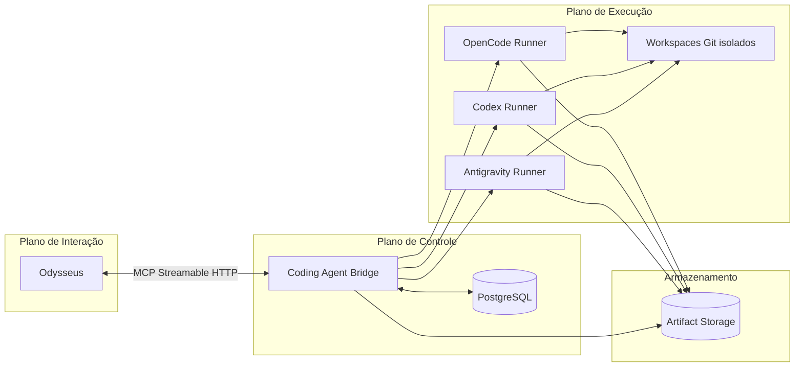
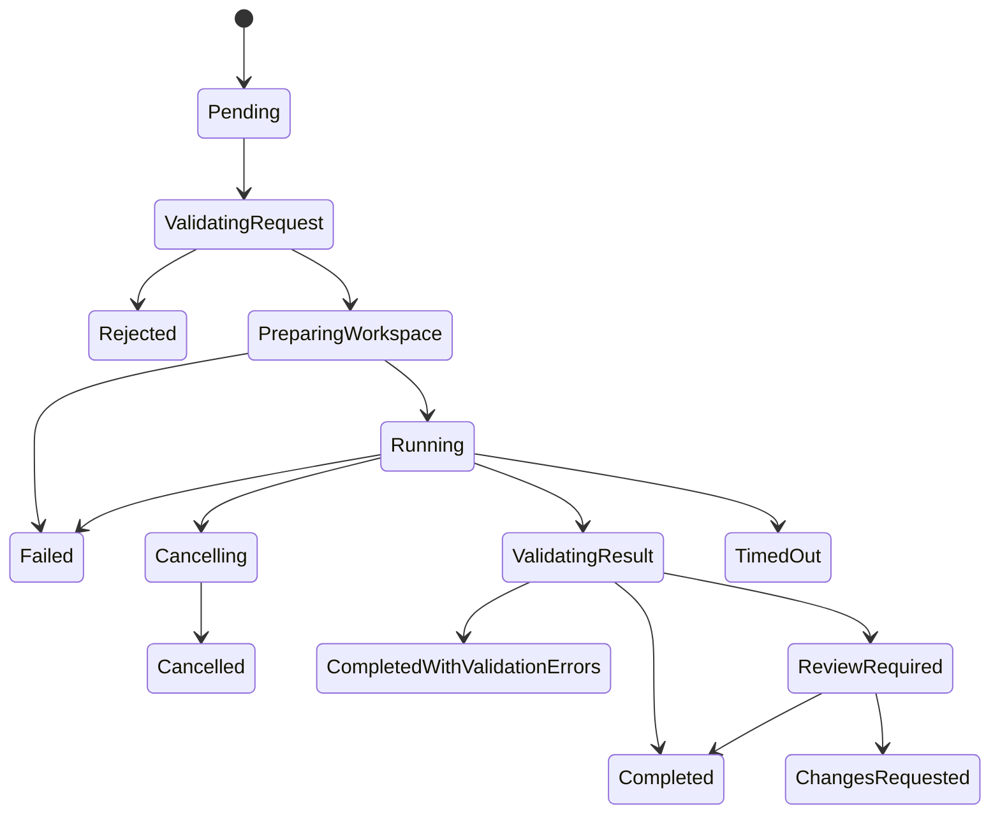

# System Design — Consolidação

> **Status:** Accepted

Documento de consolidação. Liga decisões, ADRs, specs e arquitetura em um único ponto de entrada.

## Sumário executivo

O OCAB é uma plataforma local que conecta o **Odysseus** a múltiplos agentes de desenvolvimento (OpenCode, Codex, Antigravity) por meio de um **Coding Agent Bridge** que funciona como servidor MCP. O bridge controla o ciclo de vida da execução, aplica políticas determinísticas fora do modelo, isola alterações em workspaces Git e devolve um relatório estruturado.

## Diagrama lógico

## Princípios aplicados

* Separação entre plano de interação (Odysseus), plano de controle (Bridge) e plano de execução (Runners).
* Política fora do modelo.
* Repositório original sempre read-only.
* Workspaces isolados por execução.
* Aprovação humana obrigatória para ações sensíveis.
* Auditoria completa.
* Cancelamento e timeout obrigatórios.

## Decisões arquiteturais (ADRs)

| ADR | Título | Status |
| --- | --- | --- |
| [ADR-0001](../adr/0001-odysseus-as-interaction-plane.md) | Odysseus como Interaction Plane | Accepted |
| [ADR-0002](../adr/0002-bridge-as-mcp-server.md) | Coding Agent Bridge como servidor MCP | Accepted |
| [ADR-0003](../adr/0003-agent-adapter-boundary.md) | Adapters independentes por agente | Accepted |
| [ADR-0004](../adr/0004-postgresql-as-initial-queue.md) | PostgreSQL como persistência e fila inicial | Accepted |
| [ADR-0005](../adr/0005-isolated-workspaces.md) | Workspaces isolados | Accepted |
| [ADR-0006](../adr/0006-no-docker-socket.md) | Sem Docker socket | Accepted |
| [ADR-0007](../adr/0007-policy-enforcement-outside-model.md) | Políticas críticas fora do modelo | Accepted |
| [ADR-0008](../adr/0008-human-approval-required.md) | Aprovação humana obrigatória | Accepted |
| [ADR-0009](../adr/0009-opencode-first-runner.md) | OpenCode como primeiro runner | Accepted |
| [ADR-0010](../adr/0010-codex-second-runner.md) | Codex como segundo runner | Accepted |
| [ADR-0011](../adr/0011-antigravity-post-mvp.md) | Antigravity após o MVP | Accepted |
| [ADR-0012](../adr/0012-filesystem-artifact-storage.md) | Artefatos no filesystem | Accepted |
| [ADR-0013](../adr/0013-private-docker-network.md) | Rede Docker privada | Accepted |
| [ADR-0014](../adr/0014-repository-slug-registry.md) | Repositórios identificados por slug | Accepted |
| [ADR-0015](../adr/0015-runtime-version.md) | .NET 8 LTS como runtime alvo | Accepted |

## Especificações

* [Spec 001 — Platform Foundation](../specs/001-platform-foundation/spec.md)
* [Spec 002 — Repository Registry](../specs/002-repository-registry/spec.md)
* [Spec 003 — Run Lifecycle](../specs/003-run-lifecycle/spec.md)
* [Spec 004 — MCP Contract](../specs/004-mcp-contract/spec.md)
* [Spec 005 — OpenCode Runner](../specs/005-opencode-runner/spec.md)
* [Spec 006 — Policy Engine](../specs/006-policy-engine/spec.md)
* [Spec 007 — Workspace Isolation](../specs/007-workspace-isolation/spec.md)
* [Spec 008 — Validation Pipeline](../specs/008-validation-pipeline/spec.md)
* [Spec 009 — Artifact Management](../specs/009-artifact-management/spec.md)
* [Spec 010 — Observability](../specs/010-observability/spec.md)
* [Spec 011 — Security Hardening](../specs/011-security-hardening/spec.md)
* [Spec 012 — Codex Runner](../specs/012-codex-runner/spec.md)
* [Spec 013 — Antigravity Runner](../specs/013-antigravity-runner/spec.md)
* [Spec 014 — Operations](../specs/014-operations/spec.md)

## Componentes principais

### Coding Agent Bridge

Servidor MCP escrito em .NET 8 com ASP.NET Core. Componentes internos descritos em [`component-architecture.md`](component-architecture.md).

### Runners

* **OpenCode Runner:** container separado que executa o OpenCode Server.
* **Codex Runner:** container separado para o Codex CLI (pós-MVP).
* **Antigravity Runner:** container separado para Antigravity (pós-MVP, sujeito a discovery).

### Persistência

* **PostgreSQL:** estado, fila, eventos, auditoria.
* **Artifact Storage:** filesystem para artefatos grandes.

## Fluxos

Ver [`runtime-flows.md`](runtime-flows.md).

## Restrições

Ver [`../project/scope.md`](../project/scope.md#restrições-obrigatórias).

## Modelo de execução

Ver [`../specs/003-run-lifecycle/spec.md`](../specs/003-run-lifecycle/spec.md).

## Modelo de dados

Ver [`../data/conceptual-model.md`](../data/conceptual-model.md).

## Segurança

Ver [`../security/threat-model.md`](../security/threat-model.md) e [`security-architecture.md`](security-architecture.md).

## Operação

Ver [`../operations/deployment.md`](../operations/deployment.md) e [`../specs/014-operations/spec.md`](../specs/014-operations/spec.md).

## Roadmap

Ver [`../planning/roadmap.md`](../planning/roadmap.md).

## Riscos principais

Ver [`../planning/risk-register.md`](../planning/risk-register.md).

## Questões em aberto

Ver [`../open-questions.md`](../open-questions.md).
