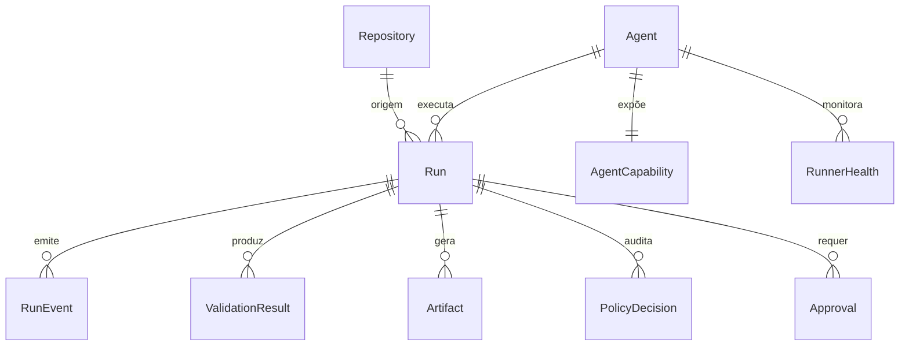

# Modelo Conceitual de Dados

> **Status:** Proposed

Define as entidades conceituais, seus campos, invariantes, relacionamentos e ciclo de vida. **Não inclui migrations reais.**

## Diagrama

## Entidades

### Repository

* **Responsabilidade:** representar um repositório autorizado pelo bridge.
* **Campos conceituais:**
  * `slug` (string, único, kebab-case)
  * `displayName`
  * `urlCanonical`
  * `defaultBranch`
  * `writable` (bool)
  * `allowedAgents` (lista de IDs)
  * `validations` (lista de comandos)
  * `policies` (referência)
  * `createdAt`
  * `updatedAt`
  * `archivedAt` (opcional)
* **Invariantes:**
  * `slug` único.
  * `writable=false` rejeita `WorkspaceWrite`.
  * `allowedAgents` é subset do catálogo de agentes.
* **Relacionamentos:**
  * 1 N → Run.
* **Índices esperados:**
  * `slug` (único).
  * `archivedAt`.
* **Retenção:**
  * Permanente enquanto ativo.
  * Arquivado após remoção lógica.
* **Dados sensíveis:** não.
* **Eventos de ciclo de vida:** `repository.created`, `repository.updated`, `repository.archived`.

### Agent

* **Responsabilidade:** representar um agente disponível.
* **Campos conceituais:**
  * `id` (string, único)
  * `displayName`
  * `enabled`
  * `imageRef`
  * `createdAt`
  * `updatedAt`
* **Invariantes:**
  * `id` imutável.
  * `enabled=false` rejeita execuções.
* **Relacionamentos:**
  * 1 1 → AgentCapability.
  * 1 N → RunnerHealth.
  * 1 N → Run.
* **Índices esperados:**
  * `id` (único).
* **Retenção:** permanente.
* **Dados sensíveis:** não.
* **Eventos de ciclo de vida:** `agent.registered`, `agent.disabled`.

### AgentCapability

* **Responsabilidade:** descrever capacidades declaradas por agente.
* **Campos conceituais:**
  * `agentId`
  * `capabilities` (lista de strings: `plan`, `implement`, `review`, `document`)
* **Invariantes:**
  * Lista finita e versionada.
* **Relacionamentos:**
  * N 1 → Agent.
* **Índices esperados:**
  * `agentId`.
* **Retenção:** permanente.
* **Dados sensíveis:** não.

### Run

* **Responsabilidade:** representar uma execução.
* **Campos conceituais:**
  * `id` (string)
  * `repositoryId`
  * `agentId`
  * `profile`
  * `runType`
  * `accessMode`
  * `baseReference`
  * `prompt` (com redaction)
  * `status`
  * `createdAt`
  * `startedAt?`
  * `finishedAt?`
  * `timeoutSeconds`
  * `idempotencyKey?`
  * `retentionDays`
  * `diagnostic` (bool)
  * `errorCode?`
  * `errorMessage?`
  * `lockRepositoryId?` (lock lógico)
* **Invariantes:**
  * Transições controladas pela spec 003.
  * `accessMode=WorkspaceWrite` requer `Repository.writable=true`.
  * `idempotencyKey` único quando preenchido.
* **Relacionamentos:**
  * N 1 → Repository.
  * N 1 → Agent.
  * 1 N → RunEvent.
  * 1 N → ValidationResult.
  * 1 N → Artifact.
  * 1 N → PolicyDecision.
  * 1 N → Approval.
* **Índices esperados:**
  * `id` (único).
  * `repositoryId, status` (concorrência).
  * `status` (fila).
  * `idempotencyKey` (único, parcial).
  * `createdAt` (consultas).
* **Retenção:**
  * Estados terminais: até `retentionDays`.
  * Estados ativos: até finalizar + retenção.
* **Dados sensíveis:** `prompt` é tratado com redaction.
* **Eventos de ciclo de vida:** todos os `run.*`.

### RunEvent

* **Responsabilidade:** registrar cada transição ou ocorrência relevante.
* **Campos conceituais:**
  * `id`
  * `runId`
  * `timestamp`
  * `actor`
  * `type`
  * `data` (JSON)
  * `fromState?`
  * `toState?`
  * `reason?`
* **Invariantes:**
  * Append-only.
* **Relacionamentos:**
  * N 1 → Run.
* **Índices esperados:**
  * `runId, timestamp`.
  * `type`.
* **Retenção:** conforme `Run`.
* **Dados sensíveis:** aplicar redaction em `data`.
* **Eventos de ciclo de vida:** —.

### ValidationResult

* **Responsabilidade:** resultado de um comando de validação.
* **Campos conceituais:**
  * `id`
  * `runId`
  * `command`
  * `exitCode`
  * `startedAt`
  * `finishedAt`
  * `durationMs`
  * `timeout` (bool)
  * `status` (`passed`, `failed`, `timeout`, `blocked`)
  * `artifacts` (lista de referências)
* **Invariantes:**
  * Comando deve estar na allowlist.
* **Relacionamentos:**
  * N 1 → Run.
* **Índices esperados:**
  * `runId`.
* **Retenção:** conforme `Run`.
* **Dados sensíveis:** stdout/stderr redaction.

### Artifact

* **Responsabilidade:** referência a arquivo no filesystem.
* **Campos conceituais:**
  * `id`
  * `runId`
  * `type`
  * `path`
  * `checksum`
  * `size`
  * `mimeType`
  * `createdAt`
  * `deletedAt?`
  * `truncated`
  * `metadata` (JSON)
* **Invariantes:**
  * Path sob `runs/<runId>/`.
  * `checksum` calculado no momento da gravação.
  * `size` consistente com `path`.
* **Relacionamentos:**
  * N 1 → Run.
* **Índices esperados:**
  * `runId, type`.
  * `path`.
  * `deletedAt`.
* **Retenção:** conforme `Run.retentionDays`.
* **Dados sensíveis:** redaction antes da gravação.

### PolicyDecision

* **Responsabilidade:** auditar cada decisão do motor de políticas.
* **Campos conceituais:**
  * `id`
  * `runId`
  * `phase`
  * `actor`
  * `policyVersion`
  * `decision`
  * `reason`
  * `timestamp`
  * `metadata` (JSON)
* **Invariantes:**
  * Imutável após gravação.
* **Relacionamentos:**
  * N 1 → Run.
* **Índices esperados:**
  * `runId, timestamp`.
  * `decision`.
* **Retenção:** conforme `Run`.
* **Dados sensíveis:** nenhuma.

### Approval

* **Responsabilidade:** registrar aprovação humana.
* **Campos conceituais:**
  * `id`
  * `runId`
  * `actor`
  * `decision`
  * `reason`
  * `timestamp`
* **Invariantes:**
  * Aprovação registrada apenas por ator humano válido.
* **Relacionamentos:**
  * N 1 → Run.
* **Índices esperados:**
  * `runId`.
* **Retenção:** conforme `Run`.
* **Dados sensíveis:** nenhuma.

### RunnerHealth

* **Responsabilidade:** registrar saúde observada de um runner.
* **Campos conceituais:**
  * `id`
  * `agentId`
  * `healthy`
  * `reason`
  * `checkedAt`
* **Invariantes:**
  * Health check periódico.
* **Relacionamentos:**
  * N 1 → Agent.
* **Índices esperados:**
  * `agentId, checkedAt`.
* **Retenção:** 7 dias (rolling).
* **Dados sensíveis:** nenhuma.

## Invariantes globais

* Toda referência a `runId` é válida.
* Estados terminais não transitam para estados não terminais.
* Decisões de política são imutáveis.
* Eventos são append-only.

## Retenção

| Entidade | Política |
| --- | --- |
| Repository | Permanente (até arquivamento lógico). |
| Agent | Permanente. |
| AgentCapability | Permanente. |
| Run | Configurável, default 30 dias. |
| RunEvent | Conforme Run. |
| ValidationResult | Conforme Run. |
| Artifact | Conforme Run. |
| PolicyDecision | Conforme Run. |
| Approval | Conforme Run. |
| RunnerHealth | 7 dias. |

## Dados sensíveis

| Campo | Tratamento |
| --- | --- |
| `Run.prompt` | Redaction + limite de tamanho. |
| Logs | Redaction. |
| Eventos | Redaction em `data`. |
| Artefatos | Redaction antes de gravação. |
| Segredos | Nunca persistidos em texto puro. |

## Referências relacionadas

* [`relational-model.md`](relational-model.md)
* [`lifecycle-and-retention.md`](lifecycle-and-retention.md)
* [`migrations-strategy.md`](migrations-strategy.md)
* [`../specs/003-run-lifecycle/spec.md`](../specs/003-run-lifecycle/spec.md)
* [`../specs/006-policy-engine/spec.md`](../specs/006-policy-engine/spec.md)
