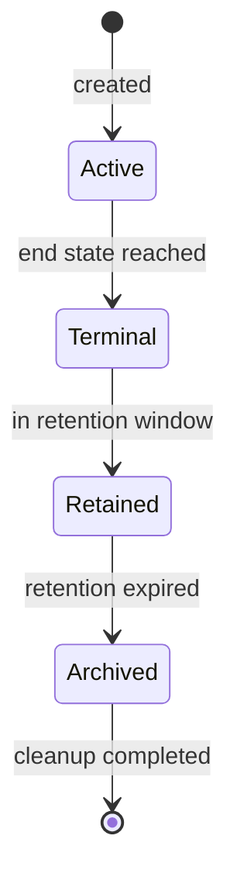

# Ciclo de Vida e Retenção

> **Status:** Proposed

Define como dados e artefatos são criados, mantidos e descartados ao longo do tempo.

## Princípios

* Retenção é explícita e configurável.
* Limpeza é assíncrona e auditada.
* Dados sensíveis são descartados preferencialmente por criptografia em vez de exclusão física.
* Backups têm retenção própria.

## Estados de uma execução

## Janela de retenção

* Default: 30 dias para execuções terminais.
* Configurável por execução via `retentionDays`.
* Configurável por ambiente.

## Retenção de backups

* Backup do PostgreSQL: default 14 dias.
* Backup de artefatos: default 14 dias.
* Backup off-host (quando aplicável): default 30 dias.

## Limpeza

### Execuções

* Identificação: `runs WHERE finished_at + retention_days < now() AND NOT diagnostic`.
* Ações:
  * Marcar artefatos como `deletedAt = now()`.
  * Remover arquivos físicos.
  * Preservar linha na tabela para auditoria por mais 90 dias (configurável).
* Lock por `runId` para evitar corrida.

### Eventos

* Eventos seguem a retenção da execução.
* Eventos órfãos (sem `runId`) são investigados.

### Artefatos

* Preservados enquanto a execução estiver ativa.
* Após retenção, removidos fisicamente.

### Health records

* Rolling window de 7 dias.

### Logs

* Logs de stdout do bridge: rotacionados externamente.
* Logs de execução: vivem como artefatos sob o `runId`.

## Auditoria de limpeza

* Tabela `cleanup_log` registra cada limpeza.
* Inclui `runId`, `reason`, `actor`, `timestamp`, `filesRemoved`, `bytesRemoved`.

## Recuperação

* Execuções em retenção podem ser recuperadas via interface operacional.
* Após expiração, recuperação depende de backup.

## Conformidade

* Right to be forgotten: requer procedimento manual documentado.
* Logs de auditoria preservados conforme política legal.

## Configuração

* Arquivo `appsettings.json` ou env var:
  * `Retention.DefaultDays`
  * `Retention.BackupDays`
  * `Retention.HealthDays`
* Override por ambiente via `appsettings.{Environment}.json`.

## Operacional

* Cron interna que executa diariamente às 03:00 (configurável).
* Spans `cleanup.execute` para tracing.
* Métricas `agent_cleanup_files_removed_total`.

## Referências relacionadas

* [`conceptual-model.md`](conceptual-model.md)
* [`relational-model.md`](relational-model.md)
* [`../specs/009-artifact-management/spec.md`](../specs/009-artifact-management/spec.md)
* [`../specs/014-operations/spec.md`](../specs/014-operations/spec.md)
* [`../operations/retention-and-cleanup.md`](../operations/retention-and-cleanup.md)
