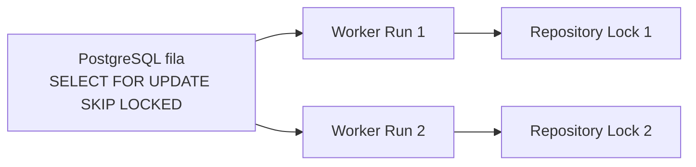

# Discovery 008 — Resource Limits Baseline

> **Status:** Completed (baseline inicial; revisitar na Fase 7)
> **Bloqueia:** Fase 1
> **Prioridade:** P0
> **Data:** 2026-07-27

## Objetivo

Definir limites iniciais conservadores para recursos de containers, execuções e payloads, baseando-se na capacidade do ambiente validado em [`001-environment-baseline.md`](001-environment-baseline.md) e nos riscos R5, R6 e R9 do [`../planning/risk-register.md`](../planning/risk-register.md).

## Ambiente de referência

| Recurso | Valor observado | Origem |
| --- | --- | --- |
| CPUs | 8 | baseline 001 |
| Memória total | 31 GiB | baseline 001 |
| Memória disponível | ~17 GiB | baseline 001 |
| Swap | 2 GiB | baseline 001 |
| Disco `/mnt/hd2` | 916 GB, 11% usado | baseline 001 |
| Disco `/` | 219 GB, 99% usado | baseline 001 |

> Decisão: trabalhar em `/mnt/hd2` (não `/` ou `/tmp`) para volumes de artefatos e `pgdata`. Disco raiz está praticamente cheio.

## Limites para o bridge

```yaml
# docker-compose.dev.yaml (referência)
services:
  ocab-bridge:
    image: ocab-bridge:dev
    user: "10001:10001"
    read_only: true
    tmpfs:
      - /tmp:size=64m,mode=1777
    security_opt:
      - no-new-privileges
    cap_drop:
      - ALL
    networks:
      - ocab-net
    expose:
      - "9010"
    environment:
      ASPNETCORE_ENVIRONMENT: Production
      ASPNETCORE_URLS: http://+:9010
      OCAB_Pg__ConnectionString: "Host=ocab-postgres;Port=5432;Username=ocab;Password=__SET_ME__;Database=ocab"
    deploy:
      resources:
        limits:
          cpus: "1.0"
          memory: 768M
          pids_limit: 256
    healthcheck:
      test: ["CMD", "wget", "--no-verbose", "--tries=1", "--spider", "http://127.0.0.1:9010/health"]
      interval: 10s
      timeout: 2s
      retries: 3
    secrets:
      - ocab_pg_password
```

> Justificativa: o bridge é uma aplicação ASP.NET Core stateless que cabe em 768 MB com folga. O limite de CPUs é conservador para não competir com os runners.

## Limites para os runners (recomendação para o MVP)

```yaml
# docker-compose.runner.yaml (referência)
services:
  ocab-opencode-runner:
    image: ocab-opencode-runner:dev
    user: "10001:10001"
    read_only: true
    tmpfs:
      - /tmp:size=128m,mode=1777
      - /home/ocab-user/.cache:size=64m
    security_opt:
      - no-new-privileges
    cap_drop:
      - ALL
    networks:
      - ocab-net
    expose:
      - "4096"
    deploy:
      resources:
        limits:
          cpus: "2.0"
          memory: 4G
          pids_limit: 512
    healthcheck:
      test: ["CMD", "wget", "--no-verbose", "--tries=1", "--spider", "http://127.0.0.1:4096/health"]
      interval: 15s
      timeout: 3s
      retries: 3
```

### Tabela

| Parâmetro | Valor | Origem da justificativa |
| --- | --- | --- |
| `cpus` | `2.0` | ambiente 8 CPUs, deixar headroom para 2 runners + bridge + host |
| `memory` | `4G` | agentes de código podem ser memory-hungry (indexação, model load) |
| `pids_limit` | `512` | protege contra fork bombs; processos esperados < 100 |
| `read_only` | `true` | ADR-0006, SH-FR-006 |
| `cap_drop` | `ALL` | SH-FR-003 |
| `no-new-privileges` | `true` | SH-FR-004 |
| `user` | `10001:10001` | SH-FR-001 |

## Limites por execução

```yaml
runs:
  globalConcurrency: 2          # máximo de Runs simultâneas em todos os repositórios
  writeConcurrencyPerRepository: 1  # ADR-0005 + spec 003 RL-FR-014
  defaultTimeoutSeconds: 1800    # 30 min
  maxTimeoutSeconds: 7200       # 2 h (limite absoluto; configurable)
  cancelGraceSeconds: 30        # bridge → runner cancel acknowledgement
  runnerHealthTimeoutSeconds: 60  # quantas falhas consecutivas antes de Failed
  buffers:
    maxOutputBytes: 10485760     # 10 MB stdout/stderr por processo
    maxEventBytes: 65536         # 64 KB por evento
    maxPromptBytes: 102400       # 100 KB prompt (MCP-NFR)
    maxPatchBytes: 1048576       # 1 MB patch; acima vira referência a artefato (MCP-FR-013)
    maxPayloadBytes: 2097152     # 2 MB payload
    maxArtifactsBytes: 524288000 # 500 MB total de artefatos por execução
  retries:
    maxAttempts: 1               # sem retry automático no MVP
  cleanup:
    defaultRetentionDays: 30
    diagnosticRetentionDays: 7   # após marcar como diagnostic
```

> Os valores são **iniciais** e devem ser reavaliados após o primeiro vertical slice (Fase 3) com dados reais.

## Concorrência e filas



* **Global:** `2` Runs simultâneas (`globalConcurrency`).
* **Por repositório de escrita:** `1` Run de cada vez; demais ficam em fila.
* **Por repositório de leitura:** até `globalConcurrency` paralelo, sem lock adicional (origem é read-only).

## Retenção e limpeza

| Item | Default | Configurável por |
| --- | --- | --- |
| `runs` (state rows) | indefinido | ambiente |
| `run_events` | 90 dias | ambiente |
| `policy_decisions` | indefinido (auditoria) | ambiente |
| Workspaces | 30 dias (`defaultRetentionDays`) | execução (`retentionDays`) |
| Artefatos | 30 dias | execução |
| Logs estruturados | segue retenção do filesystem | ambiente |

> Em `diagnostic` mode, workspace é preservado por `diagnosticRetentionDays` adicionais.

## Riscos remanescentes

| Risco | Mitigação |
| --- | --- |
| Disco cheio (`/mnt/hd2`) | alerta em uso > 80%; limpeza rotineira de workspaces > 30 dias |
| Memória pressionada durante pico | `pids_limit` + `kill -KILL` de fallback; fila absorve latência |
| CPU saturada | `globalConcurrency=2`; métricas para detectar saturação |
| Fork bomb em comando malicioso | `pids_limit=512` por runner; comandos fora do catalog são bloqueados pela policy engine |

## Questões abertas afetadas

* **OQ-031** (limites CPU/memória): `Resolved` com baseline inicial acima.
* **OQ-050**, **OQ-051**, **OQ-052**, **OQ-053** (limites por payload/evento/artefato): parcialmente resolvidas — valores iniciais definidos; revisão após Fase 3.
* **OQ-042** (retenção 30 dias): razoável para MVP; revisar em operação.

## Próximo passo

* Slice 1.1.1: criar `compose.yaml` de desenvolvimento com limites acima.
* Slice 2.2.2 (Limites e auditoria): revisar valores com dados coletados e ajustar.
* Adicionar à spec 011 (Security Hardening) referência explícita aos limites do bridge e runner.
