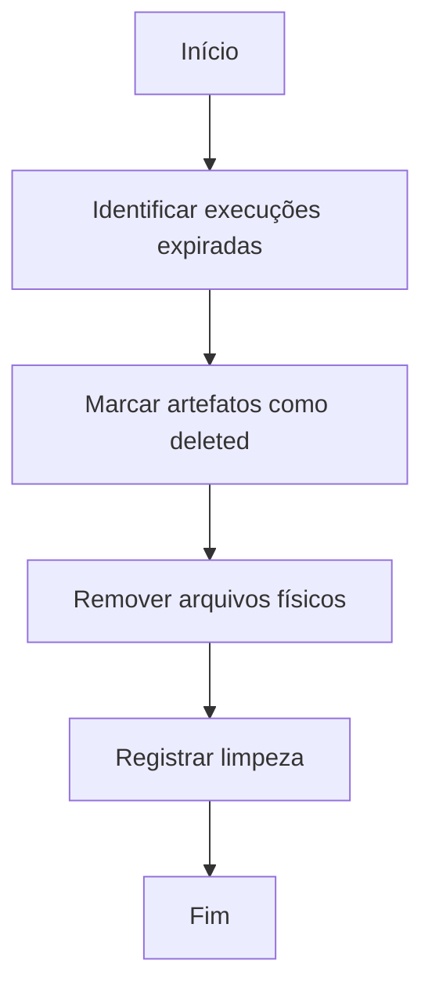

# Retenção e Limpeza

> **Status:** Proposed

Define procedimentos de retenção e limpeza de artefatos e execuções.

## Política padrão

* Execuções terminais: 30 dias.
* Backups: 14 dias (local), 30 dias (remoto).
* Health records: 7 dias.

## Cron interna

* Executada diariamente às 03:00 (configurável).
* Spans `cleanup.execute` para tracing.
* Lock por `runId` para evitar corrida.

## Procedimento



## Segurança

* Operação requer privilégios reduzidos.
* Logs de limpeza auditáveis.

## Modo `diagnostic`

* Execuções marcadas como `diagnostic=true` são preservadas.
* Liberação manual via endpoint operacional.

## Configuração

```json
{
  "ocab": {
    "retention": {
      "defaultDays": 30,
      "backupDays": 14,
      "healthDays": 7,
      "cleanupCron": "0 3 * * *"
    }
  }
}
```

## Referências relacionadas

* [`../data/lifecycle-and-retention.md`](../data/lifecycle-and-retention.md)
* [`../specs/009-artifact-management/spec.md`](../specs/009-artifact-management/spec.md)
* [`../specs/014-operations/spec.md`](../specs/014-operations/spec.md)
