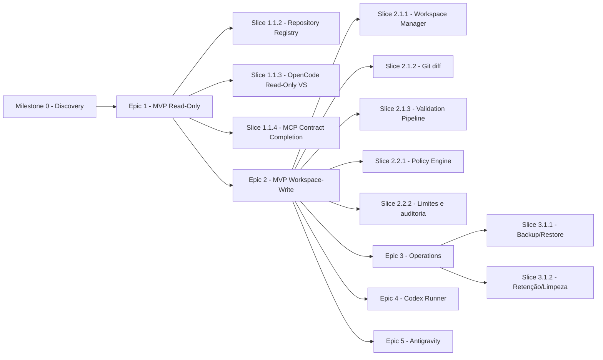

# Dependency Map — Mapa de dependências entre Milestones/Epics

> **Status:** Proposed

Mapeia dependências entre Milestones e Epics do roadmap. A nomenclatura segue a hierarquia Milestone → Epic → Slice (ver [`roadmap.md`](roadmap.md)).

## Dependências

## Dependências detalhadas

| Slice | Depende de | Bloqueia | Notas |
| --- | --- | --- | --- |
| Slice 1.1.1 (Foundation) | Milestone 0 | Slices 1.1.2 a 1.1.4 | Requer gate de Discovery fechado. |
| Slice 1.1.2 (Repository Registry) | Slice 1.1.1 | Slices 1.1.3 a 1.1.4, Epic 2 | Repositório piloto cadastrado no Discovery 004. |
| Slice 1.1.3 (OpenCode Read-Only VS) | Slice 1.1.2 | Slice 1.1.4, Epic 2 | Inclui o contrato MCP mínimo. |
| Slice 1.1.4 (MCP Contract Completion) | Slice 1.1.3 | Epic 2 | Inclui ferramentas MCP completas e qualidades contratuais. |
| Slice 2.1.1 (Workspace Manager) | Slice 1.1.3 + Slice 1.1.4 | Slices 2.1.2 a 2.1.3 | Estratégia do Discovery 005. |
| Slice 2.1.2 (Git diff) | Slice 2.1.1 | Slice 2.1.3 | — |
| Slice 2.1.3 (Validation Pipeline) | Slice 2.1.2 | Capability 2.2 | — |
| Slice 2.2.1 (Policy Engine) | Slice 2.1.3 | Slice 2.2.2 | — |
| Slice 2.2.2 (Limites e auditoria) | Slice 2.2.1 | Epic 3, Epic 4, Epic 5 | — |
| Slice 3.1.1 (Backup/Restore) | Slice 2.2.2 | Slice 3.1.2 | — |
| Slice 3.1.2 (Retenção/Limpeza) | Slice 3.1.1 | — | — |
| Epic 4 (Codex Runner) | Slice 2.2.2 | — | — |
| Epic 5 (Antigravity) | Slice 2.2.2 | — | Sujeito a discovery do Antigravity. |

## Dependências entre ADRs

| ADR | Bloqueia/decide |
| --- | --- |
| 0001 | Interação com Odysseus |
| 0002 | Contrato MCP |
| 0003 | Arquitetura de adapters |
| 0004 | Persistência |
| 0005 | Workspace isolation |
| 0006 | Hardening de containers |
| 0007 | Policy engine |
| 0008 | Aprovações humanas |
| 0009 | Vertical OpenCode |
| 0010 | Codex |
| 0011 | Antigravity |
| 0012 | Artefatos |
| 0013 | Rede Docker |
| 0014 | Slug registry |
| 0015 | Runtime .NET 8 |
| 0016 | Licença Apache-2.0 |

## Caminho crítico

1. ADRs 0001, 0002, 0004, 0006, 0007, 0014 desbloqueiam Epic 1.
2. ADRs 0005, 0009 desbloqueiam Slices 2.1.1 a 2.1.3 (Capability 2.1).
3. ADR-0008 permeia todas as fases.
4. ADRs 0015, 0016 são restrições transversais (runtime e licença).

## Bloqueios potenciais

* Mudança de MCP pode forçar revisão dos Slices 1.1.1, 1.1.3, 1.1.4.
* Mudança no OpenCode pode forçar revisão do Slice 1.1.3.
* Discovery do Antigravity pode atrasar Epic 5.
* Mudança na política de licenças pode exigir revisão da ADR-0016.

## Referências relacionadas

* [`roadmap.md`](roadmap.md)
* [`milestones.md`](milestones.md)
* [`backlog.md`](backlog.md)
