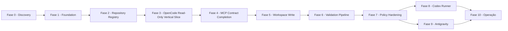

# Dependency Map — Mapa de dependências entre fases

> **Status:** Proposed

Mapeia dependências entre fases do roadmap.

## Dependências

## Dependências detalhadas

| Fase | Depende de | Bloqueia | Notas |
| --- | --- | --- | --- |
| 0 (Discovery) | — | 1 | Gate explícito antes de Fase 1. Sem código de produção. |
| 1 (Foundation) | 0 | 2, 3, 4 | Requer gate de Discovery fechado. |
| 2 (Repository Registry) | 1 | 3, 4, 5 | Repositório piloto cadastrado no Discovery 004. |
| 3 (OpenCode Read-Only VS) | 2 | 4, 5 | Inclui o contrato MCP mínimo. |
| 4 (MCP Contract Completion) | 3 | 5 | Inclui ferramentas MCP completas e qualidades contratuais. |
| 5 (Workspace Write) | 4 | 6 | Estratégia do Discovery 005. |
| 6 (Validation Pipeline) | 5 | 7 | — |
| 7 (Policy Hardening) | 6 | 8, 9 | — |
| 8 (Codex Runner) | 7 | 10 | — |
| 9 (Antigravity) | 7 | 10 | Sujeito a discovery do Antigravity. |
| 10 (Operação) | 8, 9 | — | — |

## Dependências entre ADRs

| ADR | Bloqueia/decide |
| --- | --- |
| 0001 | Interação com Odysseus |
| 0002 | Contrato MCP |
| 0003 | Arquitetura de adapters |
| 0004 | Persistência |
| 0005 | Workspace isolation |
| 0006 | Hardening de containers |
| 0007 | Policy engine |
| 0008 | Aprovações humanas |
| 0009 | Vertical OpenCode |
| 0010 | Codex |
| 0011 | Antigravity |
| 0012 | Artefatos |
| 0013 | Rede Docker |
| 0014 | Slug registry |

## Caminho crítico

1. ADR-0001, 0002, 0004, 0006, 0007, 0014 desbloqueiam Fase 1.
2. ADR-0005, 0009 desbloqueiam Fases 2 e 3.
3. ADR-0008 permeia todas as fases.

## Bloqueios potenciais

* Mudança de MCP pode forçar revisão das Fases 1, 3, 4.
* Mudança no OpenCode pode forçar revisão da Fase 3.
* Discovery do Antigravity pode atrasar Fase 9.

## Referências relacionadas

* [`roadmap.md`](roadmap.md)
* [`milestones.md`](milestones.md)
* [`backlog.md`](backlog.md)
