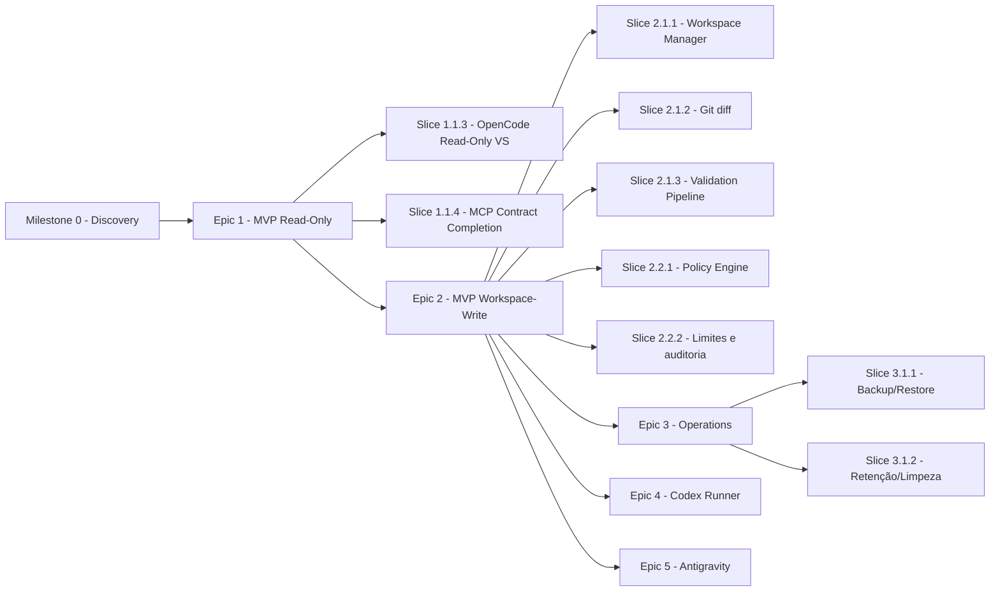

# Roadmap

> **Status:** Proposed

Roadmap incremental do OCAB organizado em **Milestones** e **Epics**, com **Slices** enumerados (ex.: Slice 1.1.3). A hierarquia substitui a nomenclatura anterior de "Fases" registrada em versões anteriores deste documento.

## Milestone 0 — Discovery

**Objetivo:** validar premissas antes de iniciar implementação.

**Entregáveis:**

* Versões alvo de ferramentas validadas (Docker Engine, .NET 8).
* Autenticação interna confirmada.
* OpenCode Server em container validado.
* Repositório piloto cadastrado.
* Prova de leitura end-to-end.
* Riscos confirmados.
* Decisões abertas reduzidas.

**Critério de saída:** decisão informada sobre seguir para o Epic 1.

## Epic 1 — MVP Read-Only

### Slice 1.1.1 — Foundation

**Objetivo:** estabelecer a base técnica do OCAB.

**Entregáveis:**

* Solução .NET 8 com ASP.NET Core.
* Bridge com health checks.
* PostgreSQL configurado.
* Compose mínimo.
* Logs estruturados.
* Persistência básica de `Run`.

**Critério de saída:** `/health`, `/ready`, `/metrics` respondem; `Run` pode ser criado e consultado.

### Slice 1.1.2 — Repository Registry

**Objetivo:** permitir cadastro e uso de repositórios por slug.

**Entregáveis:**

* Tabela `repositories`.
* `repositories_list` MCP.
* Validação em `run_create`.
* Bloqueio por `writable` e `allowedAgents`.

**Critério de saída:** repositórios cadastrados podem ser listados e usados.

### Slice 1.1.3 — OpenCode Read-Only Vertical Slice

**Objetivo:** primeira fatia vertical realmente utilizável — execução read-only ponta a ponta via MCP.

**Entregáveis:**

* Container OpenCode Runner (PoC).
* Adapter OpenCode.
* Sessão, prompt, eventos, cancelamento, timeout.
* Contrato MCP mínimo necessário para o vertical:
  * `repositories_list`
  * `run_create`
  * `run_get`
  * `run_cancel`
  * `run_report`
* Relatório simplificado no contrato de `run_report`.
* Repositório original confirmado como não alterado.

**Critério de saída:** um cliente MCP (ou o Odysseus) consegue criar uma execução read-only, acompanhar o estado, cancelar e obter um relatório, com o repositório original intocado.

**Nota:** este slice entrega o **primeiro produto observável** do OCAB.

### Slice 1.1.4 — MCP Contract Completion

**Objetivo:** completar o contrato MCP e endurecer os aspectos transversais.

**Entregáveis:**

* `agents_list`.
* `run_diff` (modos `summary`, `stat`, `patch`).
* `review_create`.
* Paginação padronizada (cursor opaco, `limit` default 50, máximo 200).
* Erros padronizados (códigos em [`../contracts/errors.md`](../contracts/errors.md)).
* Autenticação via Bearer token no MCP.
* Idempotência em `run_create` (com validação de payload divergente).
* Limites de payload (prompt, diff, payload).
* Versionamento de contrato (`X-OCAB-Contract-Version`).
* Headers de correlação (`trace_id`, `run_id`).

**Critério de saída:** todas as ferramentas MCP estão expostas com autenticação, paginação, idempotência, versionamento e limites validados.

## Epic 2 — MVP Workspace-Write

### Capability 2.1 — Workspace isolado

#### Slice 2.1.1 — Workspace Manager

**Objetivo:** permitir alterações em workspace dedicado.

**Entregáveis:**

* Workspace Manager (criação e cleanup de worktrees isolados).
* Branch de execução `agent/<repository>/<run-id>`.
* Estados adicionais: `PreparingWorkspace`, `ValidatingRequest`, `Rejected`.
* Cleanup idempotente com lock por runId.

**Critério de saída:** execução workspace-write cria workspace isolado, mantém repositório original intocado e executa cleanup após retenção.

#### Slice 2.1.2 — Git diff e status

**Objetivo:** fornecer diff ao relatório.

**Entregáveis:**

* `git status` e `git diff` no workspace.
* Persistência como artefato (`git-status.txt`, `diff-stat.txt`, `diff.patch`, `changed-files.json`).
* `run_diff` MCP com modos `summary`, `stat` e `patch`.
* Patch > 1 MB vira referência a artefato.

**Critério de saída:** `run_diff` retorna `summary`, `stat`, `patch`.

#### Slice 2.1.3 — Validation Pipeline

**Objetivo:** executar validações declarativas por repositório.

**Entregáveis:**

* Comandos por repositório (declarativos).
* Execução sequencial com timeout por comando.
* Captura de stdout/stderr.
* Status agregado distinguindo falha de validação de falha de infraestrutura.
* Estado `CompletedWithValidationErrors` quando o agente conclui mas validações falham.

**Critério de saída:** validações executadas em sequência, resultados persistidos, status final reflete validação.

### Capability 2.2 — Hardening de segurança

#### Slice 2.2.1 — Policy Engine

**Objetivo:** aplicar política determinística em todas as fases.

**Entregáveis:**

* Avaliação pré-execução.
* Avaliação por comando.
* Decisões em `policy_decisions`.
* Bloqueios: `git push`, path traversal, symlink escape, comandos fora da allowlist.

**Critério de saída:** tentativas adversariais bloqueadas e registradas.

#### Slice 2.2.2 — Limites de recursos e auditoria

**Objetivo:** prevenir abuso via limites e auditoria.

**Entregáveis:**

* Compose com `cpus`, `memory`, `pids_limit`, `read_only`, `cap_drop: ALL`, `no-new-privileges`, `user` não root.
* Métricas expostas.
* Auditoria completa.

**Critério de saída:** runner não executa como root, limites aplicados, métricas expostas.

## Epic 3 — Operations

### Slice 3.1.1 — Backup e restore

**Objetivo:** garantir recuperação.

**Entregáveis:**

* Backup diário automatizado.
* Restore testado em staging.

**Critério de saída:** backup executado e validado; restore recupera estado.

### Slice 3.1.2 — Retenção e limpeza

**Objetivo:** controlar uso de disco.

**Entregáveis:**

* Cron interna.
* Lock por `runId`.

**Critério de saída:** execuções expiradas removidas; logs de limpeza.

## Epic 4 — Codex Runner

### Slice 4.1.1 — Discovery e adapter Codex

**Objetivo:** adicionar Codex como executor/revisor.

**Entregáveis:**

* Discovery Codex CLI.
* Adapter `IRunnerAdapter` para Codex.
* Execução read-only e workspace-write.

**Critério de saída:** Codex executa via MCP.

## Epic 5 — Antigravity

### Slice 5.1.1 — Discovery da interface

**Objetivo:** validar interface disponível do Antigravity.

**Entregáveis:**

* Documentação de descoberta.
* ADR substituta ou revisão da ADR-0011.

**Critério de saída:** decisões registradas em ADR.

### Slice 5.1.2 — Adapter Antigravity read-only

**Objetivo:** integrar Antigravity em modo read-only.

**Entregáveis:**

* Adapter.
* Execução read-only.

**Critério de saída:** execução read-only funciona.

## Diagrama de roadmap

## Referências relacionadas

* [`dependency-map.md`](dependency-map.md)
* [`milestones.md`](milestones.md)
* [`backlog.md`](backlog.md)
* [`risk-register.md`](risk-register.md)
* [`definition-of-done.md`](definition-of-done.md)
