# Roadmap

> **Status:** Proposed

Roadmap incremental do OCAB dividido em fases.

## Fase 0 — Discovery

**Objetivo:** validar premissas antes de iniciar implementação.

**Entregáveis:**

* Versões alvo de ferramentas validadas (Docker Engine, .NET 8).
* Autenticação interna confirmada.
* OpenCode Server em container validado.
* Repositório piloto cadastrado.
* Prova de leitura end-to-end.
* Riscos confirmados.
* Decisões abertas reduzidas.

**Critério de saída:** decisão informada sobre seguir para Fase 1.

## Fase 1 — Foundation

**Objetivo:** estabelecer a base técnica do OCAB.

**Entregáveis:**

* Solução .NET 8 com ASP.NET Core.
* Bridge com health checks.
* PostgreSQL configurado.
* Compose mínimo.
* Logs estruturados.
* Persistência básica de `Run`.

**Critério de saída:** `/health`, `/ready`, `/metrics` respondem; `Run` pode ser criado e consultado.

## Fase 2 — Repository Registry

**Objetivo:** permitir cadastro e uso de repositórios por slug.

**Entregáveis:**

* Tabela `repositories`.
* `repositories_list` MCP.
* Validação em `run_create`.
* Bloqueio por `writable` e `allowedAgents`.

**Critério de saída:** repositórios cadastrados podem ser listados e usados.

## Fase 3 — OpenCode Read-Only Vertical Slice

**Objetivo:** primeira fatia vertical realmente utilizável — execução read-only ponta a ponta via MCP.

**Entregáveis:**

* Container OpenCode Runner (PoC).
* Adapter OpenCode.
* Sessão, prompt, eventos, cancelamento, timeout.
* Contrato MCP mínimo necessário para o vertical:
  * `repositories_list`
  * `run_create`
  * `run_get`
  * `run_cancel`
  * `run_report`
* Relatório simplificado no contrato de `run_report`.
* Repositório original confirmado como não alterado.

**Critério de saída:** um cliente MCP (ou o Odysseus) consegue criar uma execução read-only, acompanhar o estado, cancelar e obter um relatório, com o repositório original intocado.

**Nota:** esta fase entrega o **primeiro produto observável** do OCAB.

## Fase 4 — MCP Contract Completion

**Objetivo:** completar o contrato MCP e endurecer os aspectos transversais.

**Entregáveis:**

* `agents_list`.
* `run_diff` (modos `summary`, `stat`, `patch`).
* `review_create`.
* Paginação padronizada (cursor opaco, `limit` default 50, máximo 200).
* Erros padronizados (códigos em [`../contracts/errors.md`](../contracts/errors.md)).
* Autenticação via Bearer token no MCP.
* Idempotência em `run_create` (com validação de payload divergente).
* Limites de payload (prompt, diff, payload).
* Versionamento de contrato (`X-OCAB-Contract-Version`).
* Headers de correlação (`trace_id`, `run_id`).

**Critério de saída:** todas as ferramentas MCP estão expostas com autenticação, paginação, idempotência, versionamento e limites validados.

## Fase 5 — Workspace Write

**Objetivo:** permitir alterações controladas em workspace isolado.

**Entregáveis:**

* Workspace Manager.
* Branch de execução.
* Git status e diff.
* Cleanup.

**Critério de saída:** execução workspace-write produz diff.

## Fase 6 — Validation Pipeline

**Objetivo:** executar validações declarativas.

**Entregáveis:**

* Comandos por repositório.
* Execução sequencial.
* Timeout.
* Artefatos de validação.

**Critério de saída:** validações executadas e resultados persistidos.

## Fase 7 — Policy Hardening

**Objetivo:** endurecer segurança.

**Entregáveis:**

* Policy engine determinístico.
* Allowlist e blocklist.
* Limites de recursos.
* Auditoria.
* Testes de segurança ampliados.

**Critério de saída:** tentativas adversariais bloqueadas e registradas.

## Fase 8 — Codex Runner

**Objetivo:** integrar Codex.

**Entregáveis:**

* Adapter Codex.
* Execução read-only e workspace-write.
* Revisão independente.

**Critério de saída:** Codex executa via MCP.

## Fase 9 — Antigravity Discovery e Runner

**Objetivo:** validar e integrar Antigravity.

**Entregáveis:**

* Discovery documentado.
* Adapter inicial read-only.
* Validação em projeto piloto.

**Critério de saída:** Antigravity executa read-only.

## Fase 10 — Operação

**Objetivo:** operação confiável.

**Entregáveis:**

* Backup automatizado.
* Restore testado.
* Retenção e limpeza.
* Troubleshooting documentado.
* Atualização simplificada.
* Hardening final.

**Critério de saída:** operação de longo prazo viável.

## Diagrama de fases

```mermaid
flowchart LR
    P0[Fase 0 - Discovery] --> P1[Fase 1 - Foundation]
    P1 --> P2[Fase 2 - Repository Registry]
    P2 --> P3[Fase 3 - OpenCode Read-Only]
    P3 --> P4[Fase 4 - MCP Vertical Slice]
    P4 --> P5[Fase 5 - Workspace Write]
    P5 --> P6[Fase 6 - Validation Pipeline]
    P6 --> P7[Fase 7 - Policy Hardening]
    P7 --> P8[Fase 8 - Codex Runner]
    P8 --> P9[Fase 9 - Antigravity]
    P9 --> P10[Fase 10 - Operação]
```

## Referências relacionadas

* [`dependency-map.md`](dependency-map.md)
* [`milestones.md`](milestones.md)
* [`backlog.md`](backlog.md)
* [`risk-register.md`](risk-register.md)
* [`definition-of-done.md`](definition-of-done.md)
