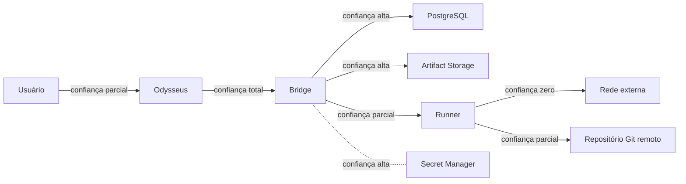

# Trust Boundaries — Fronteiras de Confiança

> **Status:** Proposed

Define as fronteiras de confiança entre os componentes do OCAB e os sistemas externos.

## Diagrama

## Fronteiras

### Fronteira 1 — Usuário ↔ Odysseus

* **Lado confiável:** Odysseus.
* **Lado não confiável:** Usuário.
* **Garantias:** entrada validada por Odysseus; bridge confia no Odysseus para formatação de prompts.
* **Riscos:** prompt injection iniciada pelo usuário é responsabilidade do Odysseus.
* **Mitigações:** policy engine do OCAB é a última barreira.

### Fronteira 2 — Odysseus ↔ Bridge

* **Lado confiável:** Bridge.
* **Lado não confiável:** Odysseus (parcialmente).
* **Garantias:** autenticação via token, validação de payloads, rate limit.
* **Riscos:** vazamento de token, payload malicioso.
* **Mitigações:** rotação de token, validação rigorosa.

### Fronteira 3 — Bridge ↔ PostgreSQL

* **Lado confiável:** Bridge.
* **Lado confiável limitado:** PostgreSQL.
* **Garantias:** credenciais em arquivo montado, rede privada.
* **Riscos:** SQL injection (mitigado por EF Core parametrizado).
* **Mitigações:** queries parametrizadas, least privilege no usuário do banco.

### Fronteira 4 — Bridge ↔ Runner

* **Lado confiável:** Bridge.
* **Lado não confiável:** Runner (parcialmente).
* **Garantias:** execução em container isolado, sem Docker socket, sem credenciais de escrita.
* **Riscos:** runner comprometido pode tentar escape.
* **Mitigações:** container hardening, política de comandos, sem rede externa.

### Fronteira 5 — Runner ↔ Rede externa

* **Lado confiável:** nenhum.
* **Garantias:** rede Docker privada, sem DNS externo por padrão.
* **Riscos:** exfiltração.
* **Mitigações:** política de rede, allowlist opcional de saída para Git remoto.

### Fronteira 6 — Runner ↔ Repositório Git remoto

* **Lado confiável limitado:** repositório remoto.
* **Garantias:** acesso read-only.
* **Riscos:** conteúdo malicioso no repositório.
* **Mitigações:** policy engine, sandbox, validação.

### Fronteira 7 — Bridge ↔ Secret Manager

* **Lado confiável:** ambos.
* **Garantias:** leitura apenas quando necessário, sem persistência em código.
* **Riscos:** vazamento durante leitura.
* **Mitigações:** uso efêmero, redaction.

## Princípios

* Toda fronteira deve ser explicitamente documentada.
* Toda comunicação entre fronteiras deve passar por validação.
* Credenciais nunca atravessam fronteiras em texto puro.
* Logs não contêm dados que cruzem fronteiras sem redaction.

## Modelo de ameaça por fronteira

### Odysseus → Bridge

* Spoofing: token inválido.
* Tampering: payload adulterado — mitigado por schema.
* Repudiation: registrado em log.
* Information disclosure: redaction.
* DoS: rate limit.
* Elevation: escopo de token limitado.

### Runner → Bridge

* Spoofing: impossível sem acesso ao DNS interno.
* Tampering: runner não escreve no banco.
* Repudiation: ações registradas.
* Information disclosure: rede restrita.
* DoS: limites de recursos.
* Elevation: sem Docker socket, sem root.

### Bridge → PostgreSQL

* Spoofing: credenciais em arquivo.
* Tampering: queries parametrizadas.
* Repudiation: logs do banco.
* Information disclosure: rede privada.
* DoS: rate limit + pool.
* Elevation: least privilege.

### Runner → Repositório remoto

* Spoofing: URL canônica validada.
* Tampering: clone read-only.
* Repudiation: log de clone.
* Information disclosure: rede privada.
* DoS: limite de tempo.
* Elevation: sem credenciais de escrita.

## Auditoria

* Toda decisão crítica é registrada com ator e timestamp.
* Decisões de fronteira são registradas em `PolicyDecision`.

## Referências relacionadas

* [`threat-model.md`](threat-model.md)
* [`secrets-management.md`](secrets-management.md)
* [`container-hardening.md`](container-hardening.md)
* [`../architecture/security-architecture.md`](../architecture/security-architecture.md)
