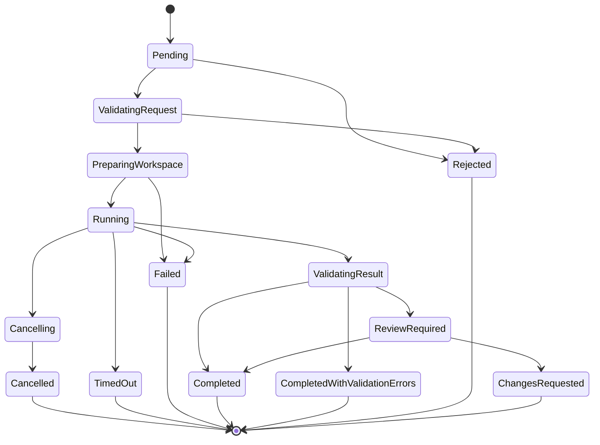

# Spec 003 — Run Lifecycle

## Status

Proposed (atualizada em 2026-07-28 pela `SLICE-STAB-003` — ver [ADR-0018](../adr/0018-persistent-run-queue.md) e [Discovery 014](../discovery/014-deterministic-e2e-lifecycle.md). Promover para `Accepted` quando os 13 critérios de aceite da slice forem satisfeitos com testes E2E verdes ponta a ponta.)

## Resumo

Define a máquina de estados completa de uma execução (`Run`), incluindo transições permitidas, idempotência, timeout, cancelamento, retry e reconciliação após restart.

## Contexto

Execuções podem falhar, ser canceladas, expirar ou exigir revisão. Sem uma máquina de estados clara, fica difícil garantir auditabilidade e comportamento previsível.

## Problema

Como modelar o ciclo de vida de uma execução de forma determinística, idempotente e auditável?

## Objetivos

* Definir estados e transições de forma explícita.
* Garantir idempotência em operações sensíveis.
* Suportar cancelamento e timeout.
* Permitir reconciliação após restart.
* Limitar concorrência de escritas por repositório.

## Não objetivos

* Suportar workflows complexos multi-etapa no MVP.
* Implementar retry com backoff adaptativo sofisticado.

## Escopo funcional

* Máquina de estados finita com 14 estados.
* Transições registradas como eventos.
* Idempotência por `idempotencyKey`.
* Timeout configurável por execução (`Run.TimeoutSeconds`).
* Cancelamento cooperativo.
* Reconciliação no startup do bridge.
* **Fila persistente no Postgres** (tabela `runs` com `status = 'Pending'`) — a fila é o próprio banco; não há broker externo.
* **`IRunExecutionCoordinator`** com `EnqueueAsync` / `WaitForTerminalStateAsync` / `CancelAsync`; exposto via DI para que clientes HTTP / MCP possam observar o terminal state deterministicamente.
* **`RunQueueWorker` (`BackgroundService`)** que poll a cada 500 ms por Runs pendentes ou órfãos, reclama via `SELECT … FOR UPDATE SKIP LOCKED` (Postgres) e delega execução ao `RunDispatcher` num escopo de `IServiceScope` por Run.
* **Registry em memória** de execuções ativas (`ConcurrentDictionary<Guid, ActiveExecution>`) com `CancellationTokenSource` e `TaskCompletionSource<RunTerminalResult>` por Run; não é fonte de verdade — é apenas cache de wake-up.

## Requisitos funcionais

* **RL-FR-001** A máquina de estados deve incluir os 14 estados definidos.
* **RL-FR-002** Toda transição deve ser registrada em `RunEvent` com timestamp e ator.
* **RL-FR-003** Transições inválidas devem ser rejeitadas com erro `invalid_state_transition`.
* **RL-FR-004** `run_create` deve aceitar `idempotencyKey`. Repetições com mesma chave e mesmo payload devem retornar a mesma execução.
* **RL-FR-005** `run_cancel` deve ser idempotente: repetições retornam o estado atual.
* **RL-FR-006** Timeout deve ser configurável por execução (default 30 min).
* **RL-FR-007** Cancelamento deve mudar estado para `Cancelling` e, após confirmação do runner, para `Cancelled`.
* **RL-FR-008** Timeout deve mudar estado para `Cancelling` e, após confirmação, para `TimedOut`.
* **RL-FR-009** Falha de runner deve levar a `Failed`.
* **RL-FR-010** Falha de validação deve levar a `CompletedWithValidationErrors`.
* **RL-FR-011** Validação OK leva a `Completed`.
* **RL-FR-012** Execuções que requerem revisão manual devem ir para `ReviewRequired`.
* **RL-FR-013** Revisão pode levar a `ChangesRequested` ou `Completed`.
* **RL-FR-014** No máximo uma execução de escrita simultânea por repositório. Execuções adicionais devem entrar em fila.
* **RL-FR-015** Após restart, execuções em estados inconsistentes devem ser reconciliadas (ver Reconciliação).

## Requisitos não funcionais

* **RL-NFR-001** Transições devem ser serializadas por `runId` via lock no banco.
* **RL-NFR-002** Mudança de estado não pode ocorrer sem evento correspondente.
* **RL-NFR-003** `run_get` deve responder em menos de 100 ms.

## Atores e componentes envolvidos

* Bridge.
* Runner (ex.: `OpenCodeAdapter`).
* Policy Engine.
* Workspace Manager.
* Validation Pipeline.
* **`RunQueueWorker` (`BackgroundService`)** — consome a fila persistente e executa Runs.
* **`RunExecutionCoordinator`** — abstração sobre a fila + worker + registry em memória; interface exposta via DI.

## Casos de uso

* Usuário cria execução read-only.
* Usuário cria execução workspace-write.
* Usuário cancela execução.
* Timeout expira durante execução.
* Bridge reinicia durante execução.
* Validação falha.

## Estados

```text
Pending
ValidatingRequest
PreparingWorkspace
Running
Cancelling
Cancelled
TimedOut
Failed
ValidatingResult
ReviewRequired
ChangesRequested
Completed
CompletedWithValidationErrors
Rejected
```

## Diagrama de estados



## Transições permitidas

| De | Para | Ator |
| --- | --- | --- |
| `Pending` | `ValidatingRequest` | Bridge |
| `Pending` | `Rejected` | Bridge |
| `ValidatingRequest` | `Rejected` | Bridge |
| `ValidatingRequest` | `PreparingWorkspace` | Bridge |
| `PreparingWorkspace` | `Failed` | Bridge |
| `PreparingWorkspace` | `Running` | Bridge |
| `Running` | `Cancelling` | Bridge, Timeout |
| `Running` | `ValidatingResult` | Runner |
| `Running` | `TimedOut` | Timeout |
| `Running` | `Failed` | Bridge |
| `Cancelling` | `Cancelled` | Bridge |
| `ValidatingResult` | `Completed` | Bridge |
| `ValidatingResult` | `CompletedWithValidationErrors` | Bridge |
| `ValidatingResult` | `ReviewRequired` | Bridge |
| `ReviewRequired` | `ChangesRequested` | Humano |
| `ReviewRequired` | `Completed` | Humano |

## Transições proibidas

* Qualquer transição que pule estados intermediários críticos.
* Transições de estado terminal para qualquer outro estado.
* Transições concorrentes (resolver via lock).

## Fluxos principais

* **Criação:** `Pending` → `ValidatingRequest` → `PreparingWorkspace` → `Running` → `ValidatingResult` → `Completed` (ou variantes de erro).
* **Cancelamento:** `Running` → `Cancelling` → `Cancelled`.

## Fluxos de erro

* **Política recusa:** `Pending` ou `ValidatingRequest` → `Rejected`.
* **Workspace falha:** `PreparingWorkspace` → `Failed`.
* **Runner falha:** `Running` → `Failed`.
* **Timeout:** `Running` → `TimedOut`.
* **Validação com falha:** `ValidatingResult` → `CompletedWithValidationErrors`.

## Idempotência

* `idempotencyKey` identifica uma execução.
* Repetição com mesma chave e mesmo payload retorna a execução existente.
* Repetição com mesma chave e payload divergente retorna `409 idempotency_conflict`.

## Timeout

* Definido por `Run.timeoutSeconds` (default 1800; configurável por execução no payload de `run_create`).
* **Implementação**: o `RunQueueWorker` registra um `CancellationTokenSource` com `CancelAfter(timeoutSeconds)` por Run. Quando o timer dispara, o CTS é acionado, a execução observa o cancelamento, chama `POST /session/{id}/abort` no runner e persiste `TimedOut` no Postgres. O `WaitForTerminalStateAsync` retorna `TimedOut` quando o `TaskCompletionSource<RunTerminalResult>` em memória é resolvido com esse status.
* Independente do `HttpClient.Timeout` (que é só para uma única request HTTP); o timeout do Run cobre o ciclo completo (incluindo retries internos do adapter).
* Ao expirar, transição automática para `TimedOut`.
* **Liberação de slot de concorrência**: ao transicionar para `TimedOut`, o worker remove a entrada do registry em memória, libera o lock pessimista por `runId` e (em execuções de escrita) libera o lock por `repositoryId`.

## Cancelamento

* Solicitado via `run_cancel`.
* **Implementação**: `RunExecutionCoordinator.CancelAsync(runId, reason, ct)` consulta o registry em memória; se a execução está ativa, aciona o `CancellationTokenSource` correspondente, que propaga para o `IRunnerAdapter.CancelAsync` e para o `HttpClient.CancelPendingRequests()`. Persiste imediatamente a transição `Running → Cancelling`. A execução em background observa o cancelamento, chama o `POST /session/{id}/abort` no runner (via adapter), termina o stream SSE e persiste o estado terminal `Cancelled`.
* Bridge envia sinal ao runner.
* Após confirmação, transição para `Cancelled`.
* Se o runner não responder em janela configurada (default 30 s), bridge marca como `Cancelled` forçado e registra evento `runner_unresponsive`.
* `WaitForTerminalStateAsync` resolve via `TaskCompletionSource` em memória (wake-up imediato) e cai para polling do Postgres (200 ms) se a entrada do registry já tiver sido limpa (cenário: bridge reiniciado entre `Enqueue` e `Wait`).
* **Idempotência**: `CancelAsync` em estado terminal (`Cancelled`, `Completed`, `Failed`, `TimedOut`) é no-op; não há regressão para `Cancelled` após `Completed`.

## Retry

* MVP não suporta retry automático de execuções falhas.
* `run_create` cria nova execução quando desejado.
* Retry manual exige nova chamada com nova `idempotencyKey`.

## Reconciliação após restart

No startup, o `RunQueueWorker`:

1. Lista execuções em estados não terminais (`Pending`, `Running`, `Cancelling`).
2. Para cada `Running` há mais de `timeoutSeconds` + margem, marca como `TimedOut`.
3. Para cada `Cancelling` há mais de `cancelGraceSeconds`, marca como `Cancelled` forçado.
4. Para cada `PreparingWorkspace` sem workspace, marca como `Failed` (`workspace_missing`).
5. **Retoma Runs órfãos**: para cada `Running` cuja `updated_at` seja recente (≤ `timeoutSeconds` / 2), reabre a execução com um novo `CancellationTokenSource` e continua de onde parou. Para Runs mais antigos, trata como `TimedOut` conforme (2).
6. **Reclama Runs pendentes**: para cada `Pending`, executa o ciclo normal (claim com `SELECT … FOR UPDATE SKIP LOCKED`, transição para `Running`, execução via `RunDispatcher`).
7. Toda transição de reconciliação registra `RunEvent` com `actor = 'reconciler'`, `reason` descrevendo a heurística aplicada e `metadata` incluindo `bridge_restart_at`.

## Concorrência

* **Claim atômico pelo worker**: `UPDATE runs SET status = 'Running', started_at = NOW() WHERE run_id = $1 AND status = 'Pending'` (verifica claim). Múltiplos workers (réplicas do bridge) podem coexistir sem execução duplicada — `WHERE status = 'Pending'` é o invariante.
* Lock pessimista por `runId` durante transições (Postgres `SELECT … FOR UPDATE`).
* Lock por `repositoryId` em execuções de escrita para serializar.
* `Pending` execuções de escrita ficam em fila até liberação do lock.

## Contratos

* [`../contracts/mcp-tools.md`](../contracts/mcp-tools.md) — `run_create`, `run_get`, `run_cancel`.
* [`../contracts/events.md`](../contracts/events.md) — eventos da máquina de estados.
* [`../contracts/errors.md`](../contracts/errors.md) — códigos de erro.

## Modelo de dados afetado

* `Run` — id, repositoryId, agentId, profile, runType, accessMode, baseReference, prompt, status, createdAt, startedAt, finishedAt, **timeoutSeconds** (NOT NULL DEFAULT 300), **idempotencyKey**, **resultJson** (carrega o relatório final do runner).
* `RunEvent` — id, runId, fromState, toState, actor, timestamp, reason, metadata.
* `Approval` — para transições mediadas por humano.
* **Migration `V006__add_run_timeout.sql`** adiciona `timeout_seconds INT NOT NULL DEFAULT 300` à tabela `runs`.

## Segurança

* Transições registradas com `actor` (sistema, humano, agente, `reconciler`).
* Toda rejeição registra motivo.
* Idempotency key validada contra tampering.
* **Sem `Task.Run` fire-and-forget não observado**: toda execução tem `CancellationTokenSource` registrado no coordinator e `TaskCompletionSource` para wake-up determinístico.

## Observabilidade

* Spans por transição.
* Métricas de tempo em cada estado.
* Eventos de cancelamento e timeout.
* **Métrica Prometheus `ocab_runs_active`** (gauge) — número de Runs atualmente em execução.
* **Métrica Prometheus `ocab_runs_queue_depth`** (gauge) — Runs em `Pending` aguardando claim pelo worker.

## Estratégia de testes

* Unitários: tabela de transições, idempotência, reconciliação, claim atômico do worker.
* Integração: ciclo completo (Pending → Running → Completed), cancelamento real via `CancellationTokenSource`, timeout real via timer, idempotência do cancelamento, persistência do `resultJson`.
* Contrato: o adapter envia `POST /session/{id}/abort` quando cancelamento é sinalizado; `CancellationToken` é propagado para o `HttpClient`; timeout HTTP não é confundido com timeout do Run.
* E2E real: bridge + Postgres + OpenCode real + provedor LLM determinístico. Cenários obrigatórios:
  1. Prompt read-only termina em `Completed` com resposta persistida.
  2. Cancelamento termina em `Cancelled` (idempotente).
  3. Timeout termina em `TimedOut`.
  4. Erro do provedor termina em `Failed`.
  5. Nenhum processo órfão fica ativo após os testes.
  6. Origem Git permanece inalterada.

## Critérios de aceite

* **RL-AC-001** Dado um `run_create` com `idempotencyKey`, quando chamado novamente com mesmo payload, então retorna a mesma execução com mesmo `runId`.
* **RL-AC-002** Dado um `run_create` com `idempotencyKey` repetida e payload divergente, então retorna `409 idempotency_conflict`.
* **RL-AC-003** Dado um `run_cancel` em estado terminal, então retorna o estado atual sem erro.
* **RL-AC-004** Dado um timeout expirado, então a execução transita automaticamente para `TimedOut`.
* **RL-AC-005** Dado duas execuções de escrita no mesmo repositório, então a segunda fica em fila.
* **RL-AC-006** Dado um restart do bridge durante `Running`, então a execução é reconciliada conforme regras (resumida do último estado persistido; órfãs antigas viram `TimedOut`).
* **RL-AC-007** Dado uma transição inválida, então é registrada em log e rejeitada.
* **RL-AC-008** Dado uma execução que completa validação com falha, então o estado final é `CompletedWithValidationErrors`.
* **RL-AC-009** Dado um prompt read-only real contra o OpenCode, então o Run termina em `Completed` com `resultJson` persistido.
* **RL-AC-010** Dado um `run_cancel` durante `Running`, então o adapter chama `POST /session/{id}/abort` no OpenCode real.
* **RL-AC-011** Dado um timeout do Run, então o `CancellationTokenSource` é acionado, o adapter propaga para o `HttpClient` (cancela requests pendentes) e o estado terminal é `TimedOut`.
* **RL-AC-012** Dado uma exception não observada no worker, então o Run transita para `Failed` com `reason` capturado.
* **RL-AC-013** Dado um restart do bridge com Run em `Running`, então o `RunQueueWorker` retoma a execução (se dentro de `timeoutSeconds` / 2) ou marca como `TimedOut` (se além).

## Dependências

* Spec 001 (Platform Foundation).
* Spec 002 (Repository Registry).
* Spec 005 (OpenCode Runner) — adapter para `IRunnerAdapter`.
* Spec 006 (Policy Engine).
* Spec 007 (Workspace Isolation).
* Spec 008 (Validation Pipeline).
* **ADR-0018** (Persistent Run Queue with Awaitable Execution Coordination).

## Riscos

* Lock contention em alta concorrência (mitigado por `FOR UPDATE SKIP LOCKED`).
* Reconciliação incorreta após falhas graves do host (mitigado pelo scan periódico e transição para `TimedOut`).
* **Cancelamento perdido se o bridge reiniciar entre `CancelAsync` e a execução em background observar o `CancellationToken`** (mitigado por reconciliação que detecta Runs em `Cancelling` antigos e força transição para `Cancelled`).
* **Worker crash pode deixar Run órfão** (mitigado pela reconciliação no startup).

## Decisões relacionadas

* [ADR-0004](../adr/0004-postgresql-as-initial-queue.md) — Postgres como fila inicial (foundation para ADR-0018).
* [ADR-0005](../adr/0005-isolated-workspaces.md)
* [ADR-0008](../adr/0008-human-approval-required.md)
* [ADR-0017](../adr/0017-pin-opencode-version.md) — pin de versão do OpenCode (foundation para validação E2E).
* [ADR-0018](../adr/0018-persistent-run-queue.md) — Persistent Run Queue com `IRunExecutionCoordinator` e `RunQueueWorker`.

## Questões em aberto

* Janela exata de `cancelGraceSeconds`.
* Estratégia de backoff em reconexão com runner.
* Quando substituir poll loop por `LISTEN/NOTIFY` do Postgres (vide ADR-0018 § Critérios para revisitar).

## Fora de escopo

* Workflow multi-etapa.
* Retry automático.
* Sub-execuções encadeadas.
* `LISTEN/NOTIFY` no Postgres para substituir poll (diferido para pós-MVP).

## Estratégia de entrega incremental

1. Tabelas `Run` e `RunEvent` (já existentes).
2. Estados iniciais e transições triviais (já existentes).
3. Idempotência (já existente).
4. Timeout (já existente — timer interno).
5. Cancelamento (já existente — mas refatorado para usar `CancellationTokenSource` no coordinator).
6. **Fila persistente + `IRunExecutionCoordinator` + `RunQueueWorker`** — `SLICE-STAB-003`.
7. Reconciliação.
8. Lock de escrita por repositório.
9. **Validação E2E ponta a ponta com provedor LLM determinístico** — `SLICE-STAB-003`.
