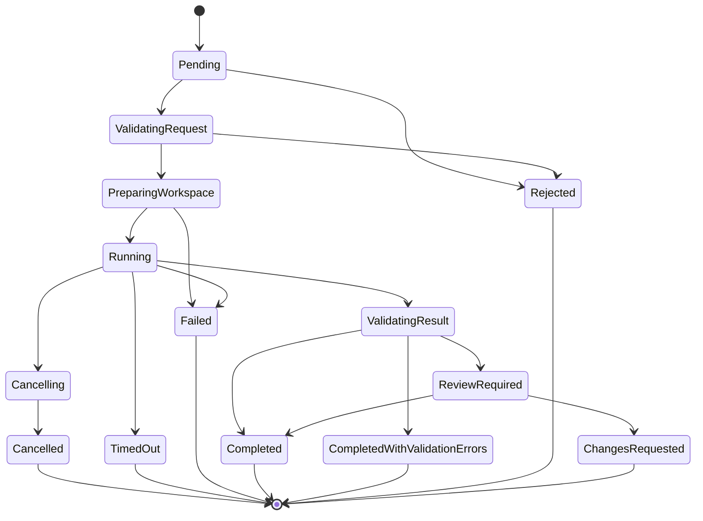

# Spec 003 — Run Lifecycle

## Status

Proposed

## Resumo

Define a máquina de estados completa de uma execução (`Run`), incluindo transições permitidas, idempotência, timeout, cancelamento, retry e reconciliação após restart.

## Contexto

Execuções podem falhar, ser canceladas, expirar ou exigir revisão. Sem uma máquina de estados clara, fica difícil garantir auditabilidade e comportamento previsível.

## Problema

Como modelar o ciclo de vida de uma execução de forma determinística, idempotente e auditável?

## Objetivos

* Definir estados e transições de forma explícita.
* Garantir idempotência em operações sensíveis.
* Suportar cancelamento e timeout.
* Permitir reconciliação após restart.
* Limitar concorrência de escritas por repositório.

## Não objetivos

* Suportar workflows complexos multi-etapa no MVP.
* Implementar retry com backoff adaptativo sofisticado.

## Escopo funcional

* Máquina de estados finita com 14 estados.
* Transições registradas como eventos.
* Idempotência por `idempotencyKey`.
* Timeout configurável por execução.
* Cancelamento cooperativo.
* Reconciliação no startup do bridge.

## Requisitos funcionais

* **RL-FR-001** A máquina de estados deve incluir os 14 estados definidos.
* **RL-FR-002** Toda transição deve ser registrada em `RunEvent` com timestamp e ator.
* **RL-FR-003** Transições inválidas devem ser rejeitadas com erro `invalid_state_transition`.
* **RL-FR-004** `run_create` deve aceitar `idempotencyKey`. Repetições com mesma chave e mesmo payload devem retornar a mesma execução.
* **RL-FR-005** `run_cancel` deve ser idempotente: repetições retornam o estado atual.
* **RL-FR-006** Timeout deve ser configurável por execução (default 30 min).
* **RL-FR-007** Cancelamento deve mudar estado para `Cancelling` e, após confirmação do runner, para `Cancelled`.
* **RL-FR-008** Timeout deve mudar estado para `Cancelling` e, após confirmação, para `TimedOut`.
* **RL-FR-009** Falha de runner deve levar a `Failed`.
* **RL-FR-010** Falha de validação deve levar a `CompletedWithValidationErrors`.
* **RL-FR-011** Validação OK leva a `Completed`.
* **RL-FR-012** Execuções que requerem revisão manual devem ir para `ReviewRequired`.
* **RL-FR-013** Revisão pode levar a `ChangesRequested` ou `Completed`.
* **RL-FR-014** No máximo uma execução de escrita simultânea por repositório. Execuções adicionais devem entrar em fila.
* **RL-FR-015** Após restart, execuções em estados inconsistentes devem ser reconciliadas (ver Reconciliação).

## Requisitos não funcionais

* **RL-NFR-001** Transições devem ser serializadas por `runId` via lock no banco.
* **RL-NFR-002** Mudança de estado não pode ocorrer sem evento correspondente.
* **RL-NFR-003** `run_get` deve responder em menos de 100 ms.

## Atores e componentes envolvidos

* Bridge.
* Runner.
* Policy Engine.
* Workspace Manager.
* Validation Pipeline.

## Casos de uso

* Usuário cria execução read-only.
* Usuário cria execução workspace-write.
* Usuário cancela execução.
* Timeout expira durante execução.
* Bridge reinicia durante execução.
* Validação falha.

## Estados

```text
Pending
ValidatingRequest
PreparingWorkspace
Running
Cancelling
Cancelled
TimedOut
Failed
ValidatingResult
ReviewRequired
ChangesRequested
Completed
CompletedWithValidationErrors
Rejected
```

## Diagrama de estados



## Transições permitidas

| De | Para | Ator |
| --- | --- | --- |
| `Pending` | `ValidatingRequest` | Bridge |
| `Pending` | `Rejected` | Bridge |
| `ValidatingRequest` | `Rejected` | Bridge |
| `ValidatingRequest` | `PreparingWorkspace` | Bridge |
| `PreparingWorkspace` | `Failed` | Bridge |
| `PreparingWorkspace` | `Running` | Bridge |
| `Running` | `Cancelling` | Bridge, Timeout |
| `Running` | `ValidatingResult` | Runner |
| `Running` | `TimedOut` | Timeout |
| `Running` | `Failed` | Bridge |
| `Cancelling` | `Cancelled` | Bridge |
| `ValidatingResult` | `Completed` | Bridge |
| `ValidatingResult` | `CompletedWithValidationErrors` | Bridge |
| `ValidatingResult` | `ReviewRequired` | Bridge |
| `ReviewRequired` | `ChangesRequested` | Humano |
| `ReviewRequired` | `Completed` | Humano |

## Transições proibidas

* Qualquer transição que pule estados intermediários críticos.
* Transições de estado terminal para qualquer outro estado.
* Transições concorrentes (resolver via lock).

## Fluxos principais

* **Criação:** `Pending` → `ValidatingRequest` → `PreparingWorkspace` → `Running` → `ValidatingResult` → `Completed` (ou variantes de erro).
* **Cancelamento:** `Running` → `Cancelling` → `Cancelled`.

## Fluxos de erro

* **Política recusa:** `Pending` ou `ValidatingRequest` → `Rejected`.
* **Workspace falha:** `PreparingWorkspace` → `Failed`.
* **Runner falha:** `Running` → `Failed`.
* **Timeout:** `Running` → `TimedOut`.
* **Validação com falha:** `ValidatingResult` → `CompletedWithValidationErrors`.

## Idempotência

* `idempotencyKey` identifica uma execução.
* Repetição com mesma chave e mesmo payload retorna a execução existente.
* Repetição com mesma chave e payload divergente retorna `409 idempotency_conflict`.

## Timeout

* Definido por `Run.timeoutSeconds` (default 1800).
* Implementado via timer interno do bridge, não dependente do runner.
* Ao expirar, transição automática para `TimedOut`.

## Cancelamento

* Solicitado via `run_cancel`.
* Bridge envia sinal ao runner.
* Após confirmação, transição para `Cancelled`.
* Se o runner não responder em janela configurada (default 30 s), bridge marca como `Cancelled` forçado e registra evento `runner_unresponsive`.

## Retry

* MVP não suporta retry automático de execuções falhas.
* `run_create` cria nova execução quando desejado.
* Retry manual exige nova chamada com nova `idempotencyKey`.

## Reconciliação após restart

No startup, o bridge:

1. Lista execuções em estados não terminais.
2. Para cada `Running` há mais de `timeoutSeconds` + margem, marca como `TimedOut`.
3. Para cada `Cancelling` há mais de `cancelGraceSeconds`, marca como `Cancelled` forçado.
4. Para cada `PreparingWorkspace` sem workspace, marca como `Failed` (`workspace_missing`).

## Concorrência

* Lock pessimista por `runId` durante transições.
* Lock por `repositoryId` em execuções de escrita para serializar.
* `Pending` execuções de escrita ficam em fila até liberação do lock.

## Contratos

* [`../contracts/mcp-tools.md`](../contracts/mcp-tools.md) — `run_create`, `run_get`, `run_cancel`.
* [`../contracts/events.md`](../contracts/events.md) — eventos da máquina de estados.
* [`../contracts/errors.md`](../contracts/errors.md) — códigos de erro.

## Modelo de dados afetado

* `Run` — id, repositoryId, agentId, profile, runType, accessMode, baseReference, prompt, status, createdAt, startedAt, finishedAt, timeoutSeconds, idempotencyKey.
* `RunEvent` — id, runId, fromState, toState, actor, timestamp, reason, metadata.
* `Approval` — para transições mediadas por humano.

## Segurança

* Transições registradas com `actor` (sistema, humano, agente).
* Toda rejeição registra motivo.
* Idempotency key validada contra tampering.

## Observabilidade

* Spans por transição.
* Métricas de tempo em cada estado.
* Eventos de cancelamento e timeout.

## Estratégia de testes

* Unitários: tabela de transições, idempotência, reconciliação.
* Integração: ciclo completo, cancelamento, timeout simulado.
* Concorrência: duas execuções de escrita no mesmo repositório — uma fica em fila.

## Critérios de aceite

* **RL-AC-001** Dado um `run_create` com `idempotencyKey`, quando chamado novamente com mesmo payload, então retorna a mesma execução com mesmo `runId`.
* **RL-AC-002** Dado um `run_create` com `idempotencyKey` repetida e payload divergente, então retorna `409 idempotency_conflict`.
* **RL-AC-003** Dado um `run_cancel` em estado terminal, então retorna o estado atual sem erro.
* **RL-AC-004** Dado um timeout expirado, então a execução transita automaticamente para `TimedOut`.
* **RL-AC-005** Dado duas execuções de escrita no mesmo repositório, então a segunda fica em fila.
* **RL-AC-006** Dado um restart do bridge durante `Running`, então a execução é reconciliada conforme regras.
* **RL-AC-007** Dado uma transição inválida, então é registrada em log e rejeitada.
* **RL-AC-008** Dado uma execução que completa validação com falha, então o estado final é `CompletedWithValidationErrors`.

## Dependências

* Spec 001 (Platform Foundation).
* Spec 002 (Repository Registry).
* Spec 006 (Policy Engine).
* Spec 007 (Workspace Isolation).
* Spec 008 (Validation Pipeline).

## Riscos

* Lock contention em alta concorrência.
* Reconciliação incorreta após falhas graves do host.

## Decisões relacionadas

* [ADR-0004](../adr/0004-postgresql-as-initial-queue.md)
* [ADR-0005](../adr/0005-isolated-workspaces.md)
* [ADR-0008](../adr/0008-human-approval-required.md)

## Questões em aberto

* Janela exata de `cancelGraceSeconds`.
* Estratégia de backoff em reconexão com runner.

## Fora de escopo

* Workflow multi-etapa.
* Retry automático.
* Sub-execuções encadeadas.

## Estratégia de entrega incremental

1. Tabelas `Run` e `RunEvent`.
2. Estados iniciais e transições triviais.
3. Idempotência.
4. Timeout.
5. Cancelamento.
6. Reconciliação.
7. Lock de escrita por repositório.
