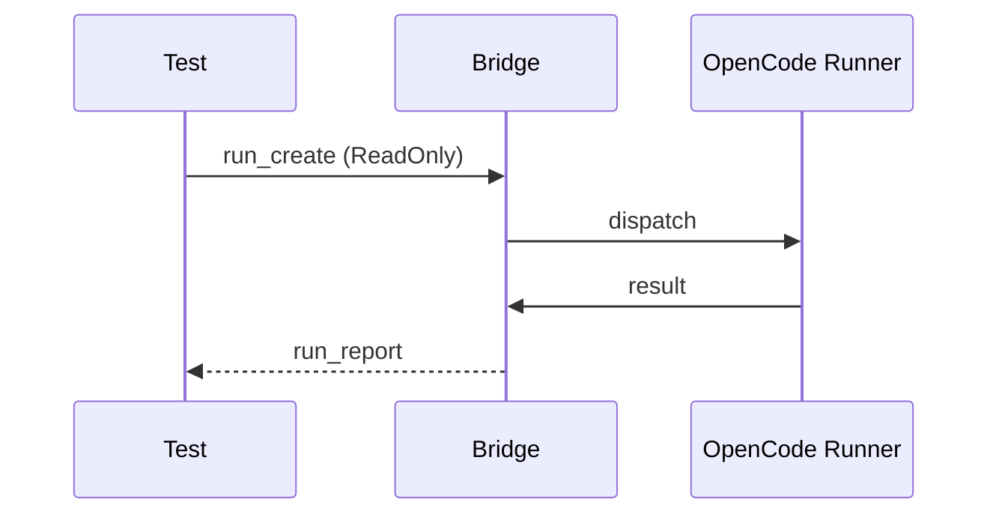
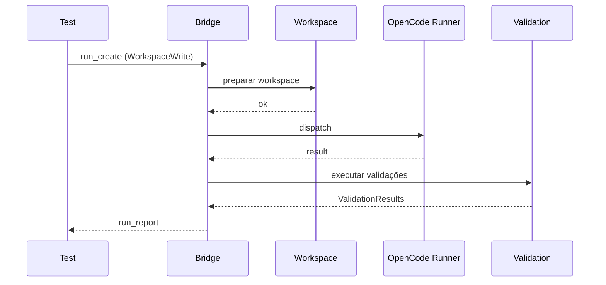
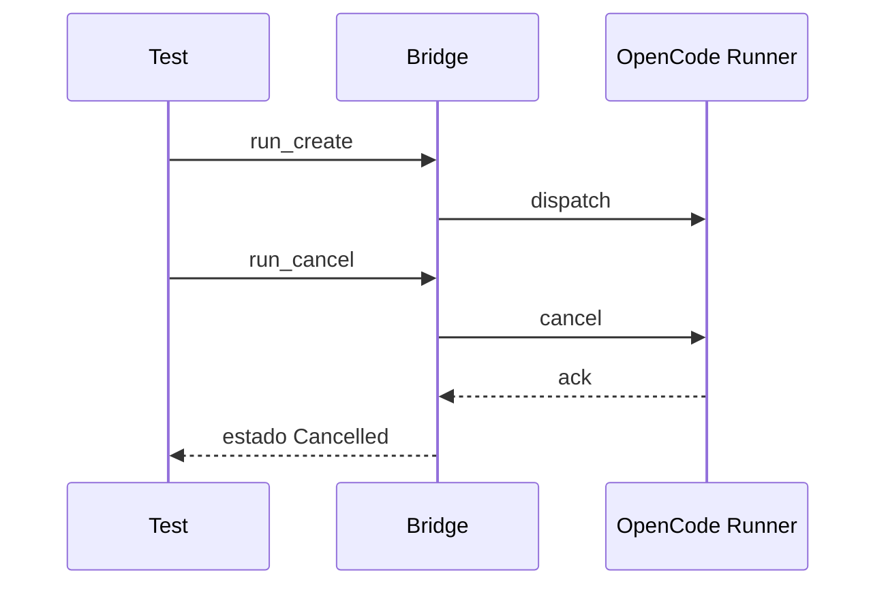

# Acceptance Tests

> **Status**: Proposed

Define testes de aceitação que validam o MVP ponta a ponta.

## Fluxo 1 — Análise read-only

### Critérios

* `runId` retornado.
* Estado final `Completed`.
* Relatório contém summary, filesChanged (vazio em ReadOnly), validations, findings.
* Repositório original não foi alterado.

## Fluxo 2 — Implementação workspace-write

### Critérios

* Workspace isolado criado.
* Diff disponível.
* Validações executadas.
* Repositório original não alterado.
* Estado final conforme validação.

## Fluxo 3 — Cancelamento

### Critérios

* Estado final `Cancelled`.
* Eventos `runner.session_cancelled` registrados.

## Fluxo 4 — Timeout

* Idempotência: `run_create` repetido retorna mesma execução.

### Critérios

* `run_create` com `idempotencyKey` repetido retorna mesmo `runId`.
* Com payload divergente retorna 409.

## Ambiente

* Compose local em CI.
* Repositório de teste.
* Token dedicado.

## Critérios de aceite globais

* Todos os 25 critérios de aceite do MVP passam.

## Referências relacionadas

* [`strategy.md`](strategy.md)
* [`../planning/backlog.md`](../planning/backlog.md)
* [`../specs/003-run-lifecycle/spec.md`](../specs/003-run-lifecycle/spec.md)
