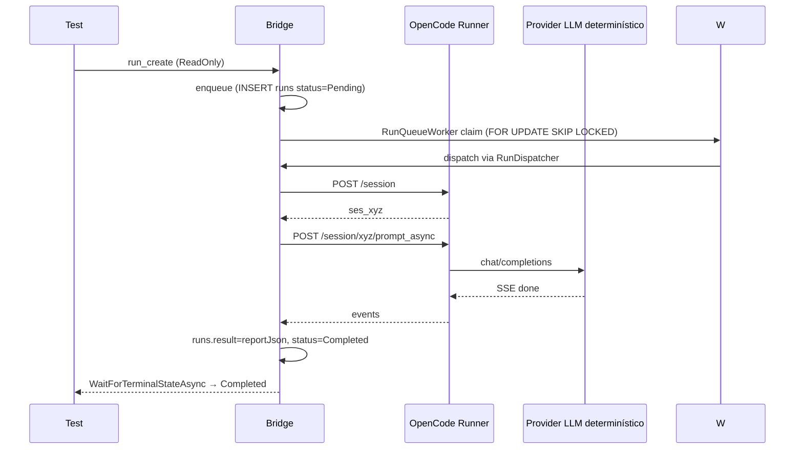
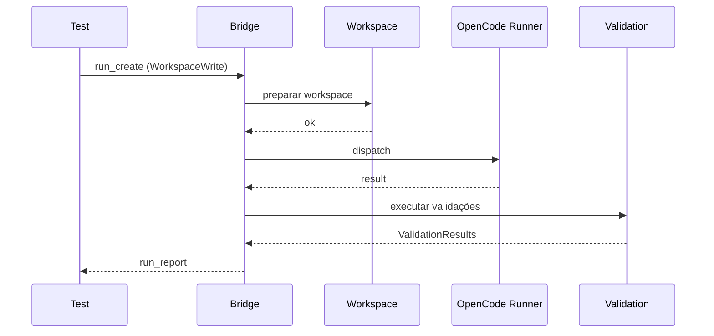
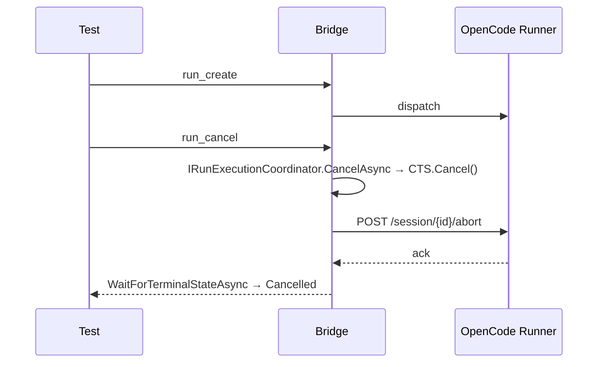
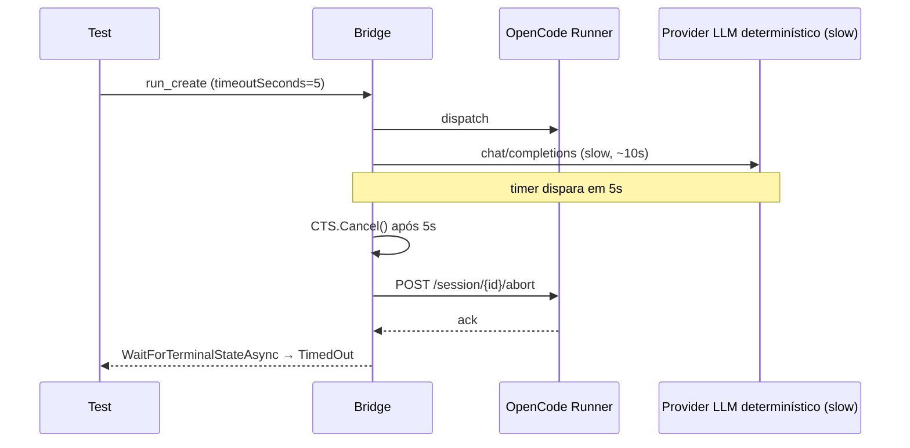

# Acceptance Tests

> **Status**: Proposed

Define testes de aceitação que validam o MVP ponta a ponta.

## Fluxo 1 — Análise read-only (E2E ponta a ponta)

### Critérios

* `runId` retornado pelo `run_create`.
* Estado final `Completed`.
* Relatório contém summary, filesChanged (vazio em ReadOnly), validations, findings — persistido em `runs.result_json`.
* Repositório original não foi alterado (validado por `git rev-parse HEAD` antes/depois).
* Nenhum processo órfão fica ativo após o teste.
* Coberto por `DeterministicCoordinatorTests.Prompt_readonly_terminates_in_completed_with_persisted_report`.

## Fluxo 2 — Implementação workspace-write

### Critérios

* Workspace isolado criado.
* Diff disponível.
* Validações executadas.
* Repositório original não alterado.
* Estado final conforme validação.
* (Diferido para `SLICE-WORKSPACE-001`.)

## Fluxo 3 — Cancelamento real (E2E)

### Critérios

* Estado final `Cancelled`.
* Eventos `runner.session_cancelled` registrados.
* `POST /session/{id}/abort` foi chamado no OpenCode real (validado por asserção no teste ou por log do runner).
* Cancelamento em estado terminal (`Cancelled`, `Completed`, `Failed`, `TimedOut`) é idempotente (não há regressão).
* Cancelamento após `Completed` não altera o estado.
* Motivo (`reason`) é persistido em `run_events`.
* Nenhum processo órfão fica ativo após o cancelamento.
* Nenhuma transição posterior de `Cancelled` para `Completed`.
* Coberto por `DeterministicCoordinatorTests.Cancel_terminates_in_cancelled_and_aborts_opencode_session`.

## Fluxo 4 — Timeout real (E2E)

### Critérios

* `run_create` com `timeoutSeconds=5` retorna Run com timeout configurado.
* Provider determinístico configurado como `slow` segura a resposta por ≥ `timeoutSeconds`.
* Estado terminal `TimedOut`.
* Evento de timeout registrado em `run_events` com `actor='timeout'`.
* `POST /session/{id}/abort` foi chamado (cancelamento upstream).
* Slot de concorrência liberado.
* Ausência de execução órfã.
* Coberto por `DeterministicCoordinatorTests.Timeout_terminates_in_timedout_when_provider_is_slow`.

## Fluxo 5 — Idempotência

### Critérios

* `run_create` com `idempotencyKey` repetido retorna mesmo `runId`.
* Com payload divergente retorna 409.

## Ambiente

* Compose local em CI.
* Repositório de teste (`git rev-parse HEAD` antes/depois).
* Token dedicado (`OCAB_MCP_TOKEN`).
* **Provedor LLM determinístico** (compatível com OpenAI `/v1/chat/completions`) em `poc/opencode-provider/` rodando em porta separada do runner; configurável via `/control/scenario` (`normal`, `slow`, `blocked`, `error`, `invalid`).
* **Bridge**: `Ocab.OpenCodeUrl` aponta para o OpenCode runner; `Ocab.OpenCodeProviderUrl` aponta para o provider determinístico.

## Critérios de aceite globais

* Todos os 25 critérios de aceite do MVP passam.
* Cenários E2E ponta a ponta de Fluxo 1, 3 e 4 verdes (ver `Discovery 014`).
* Nenhum processo órfão após `dotnet test OcabBridge.slnx`.
* Origem Git permanece inalterada.

## Referências relacionadas

* [`strategy.md`](strategy.md)
* [`../planning/backlog.md`](../planning/backlog.md)
* [`../specs/003-run-lifecycle/spec.md`](../specs/003-run-lifecycle/spec.md)
* [`../adr/0018-persistent-run-queue.md`](../adr/0018-persistent-run-queue.md)
* [`../discovery/014-deterministic-e2e-lifecycle.md`](../discovery/014-deterministic-e2e-lifecycle.md)
