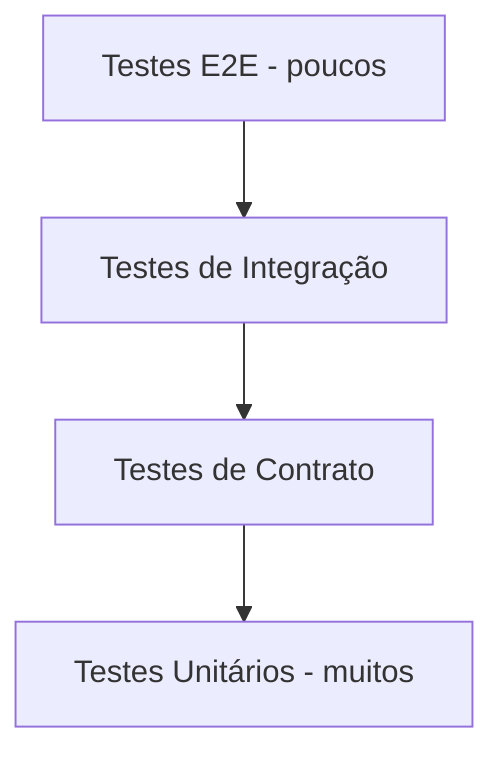

# Test Pyramid

> **Status:** Proposed

Define a distribuição de testes por camada.

## Distribuição

## Proporção sugerida

* **70%** unitários.
* **15%** de contrato.
* **10%** de integração.
* **4%** de segurança.
* **1%** E2E.

## Quando usar cada tipo

* **Unitário:** regras, validações, máquina de estados.
* **Contrato:** schemas JSON, mapeamento de eventos.
* **Integração:** Postgres, filesystem, OpenCode Server.
* **Segurança:** cenários adversariais.
* **E2E:** fluxos completos em ambiente controlado.

## Tempo de execução

* Unitários: < 1 min total.
* Contrato: < 2 min.
* Integração: < 5 min.
* Segurança: < 10 min.
* E2E: < 15 min.

## Isolamento

* Cada teste usa banco dedicado ou transações revertidas.
* Filesystem temporário por teste.
* Sem dependência entre testes.

## CI

* Unitários e contrato em todo PR.
* Integração em PRs para main.
* Segurança e E2E em nightly.

## Referências relacionadas

* [`strategy.md`](strategy.md)
